<picture>
  <source media="(max-width: 600px)" srcset="assets/stein-header-mobile.svg">
  
</picture>

<picture>
  <source media="(max-width: 600px)" srcset="assets/stein-engineering-mobile.svg">
  
</picture>

<a href="https://github.com/ducanhnguyen223/opsdesk">
  <picture>
    <source media="(max-width: 600px)" srcset="assets/stein-opsdesk-mobile.svg">
    
  </picture>
</a>

<a href="https://github.com/ducanhnguyen223/llm-reliability-bench">
  <picture>
    <source media="(max-width: 600px)" srcset="assets/stein-bench-mobile.svg">
    
  </picture>
</a>

<picture>
  <source media="(max-width: 600px)" srcset="assets/stein-vanban-mobile.svg">
  
</picture>

<a href="mailto:ducanhtq88@gmail.com">
  <picture>
    <source media="(max-width: 600px)" srcset="assets/stein-contact-mobile.svg">
    
  </picture>
</a>

Read the profile as text · project links &amp; contact

# Albert anhstein / AI Engineer

I build **LLM applications** that connect business context, useful tools and decisions people can review.

[Engineering](#engineering) · [Selected work](#selected-work) · [Contact](#contact)

## Engineering

- **LLM applications** — model APIs, structured outputs and document workflows.
- **Retrieval** — RAG, source citations and hybrid retrieval experiments.
- **Agent tooling** — MCP, scoped tools and approval workflows.
- **Reliability** — evaluation, failure cases and cache invalidation.

## Selected work

### [OpsDesk ↗](https://github.com/ducanhnguyen223/opsdesk)

AI assistance for shipment exceptions. Brings order facts and relevant procedures together so an operations specialist can review the next action.

Inside OpsDesk

Scoped retrieval, source citations and human approval before creating an internal ticket. Built around simulated operations data.

**Stack:** Python · FastAPI · SQLite · MCP

### [LLM Reliability & Cache Bench ↗](https://github.com/ducanhnguyen223/llm-reliability-bench)

An offline evaluation toolkit for deciding when a cached LLM answer can still be reused after its context changes.

Inside the evaluation toolkit

Reproducible scenarios for changes in source data, permissions and policy. Explores cache correctness and the limits of semantic similarity.

**Focus:** Python · LLM evaluation · cache invalidation

### VanBanAI

Vietnamese document workflows combining retrieval, structured drafting, review and Word/PDF export. **Private · in development.**

Inside the document workflow

The model works with structured facts and source references; review and export form separate steps. Legal-source validation and release work are ongoing.

## Tools I work with

`Python` `TypeScript` `FastAPI` `Node.js` `SQL` `MCP` `Docker` `GitHub Actions`

## Contact

[Email ↗](mailto:ducanhtq88@gmail.com) · [Explore my repositories ↗](https://github.com/ducanhnguyen223?tab=repositories)

