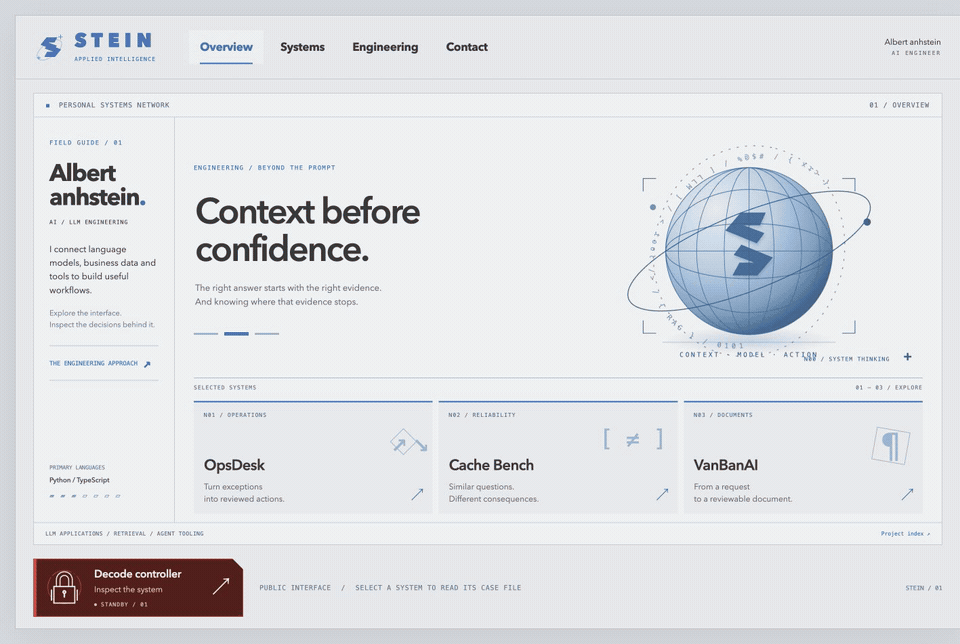

# Albert anhstein.

**AI Engineer · Applied AI / LLM systems**

I build AI workflows that connect language models to useful context, tools and reviewable actions.

## Engineering focus

| LLM applications | Retrieval and knowledge |
| --- | --- |
| Model APIs · structured outputs · workflow design | RAG · BM25 · hybrid retrieval experiments · source citations |

| Agent tooling | Reliability and evaluation |
| --- | --- |
| MCP · scoped tools · human approval | Cache correctness · stale context · reproducible failure cases |

## Selected systems

### [OpsDesk ↗](https://github.com/ducanhnguyen223/opsdesk)

An AI-assisted workflow for shipment exceptions. It brings affected orders and relevant procedures together so an operations specialist can review a proposed internal action. The scenario data is simulated.

`Python` · `FastAPI` · `MCP` · `SQLite`

### [LLM Reliability & Cache Bench ↗](https://github.com/ducanhnguyen223/llm-reliability-bench)

An offline toolkit for exploring when a cached model answer becomes unsafe after its source data, access rules or policy changes.

`Python` · `LLM evaluation` · `cache invalidation`

### VanBanAI · In development

A private project exploring Vietnamese document workflows with retrieval, structured drafting, review and Word/PDF export. Legal-source validation and release work are ongoing.

## How I approach a workflow

**Understand the decision → retrieve scoped context → validate the output → keep consequential actions reviewable.**

## Toolchain

`Python` · `TypeScript` · `FastAPI` · `Node.js` · `SQL` · `MCP` · `Docker` · `GitHub Actions`

## Contact

[ducanhtq88@gmail.com](mailto:ducanhtq88@gmail.com) · [Repositories](https://github.com/ducanhnguyen223?tab=repositories)
