<picture>
  <source media="(max-width: 600px)" srcset="assets/soukyu-console-mobile.svg">
  
</picture>

<picture>
  <source media="(max-width: 600px)" srcset="assets/soukyu-activity-mobile.svg">
  
</picture>

<picture>
  <source media="(max-width: 600px)" srcset="assets/soukyu-records-mobile.svg">
  
</picture>

<a href="https://github.com/ducanhnguyen223/opsdesk">
<picture>
  <source media="(max-width: 600px)" srcset="assets/soukyu-opsdesk-mobile.svg">
  
</picture>
</a>

<a href="https://github.com/ducanhnguyen223/llm-reliability-bench">
<picture>
  <source media="(max-width: 600px)" srcset="assets/soukyu-bench-mobile.svg">
  
</picture>
</a>

<picture>
  <source media="(max-width: 600px)" srcset="assets/soukyu-vanban-mobile.svg">
  
</picture>

<a href="mailto:ducanhtq88@gmail.com">GET IN TOUCH ↗</a> · <a href="https://github.com/ducanhnguyen223?tab=repositories">EXPLORE REPOSITORIES ↗</a>

Profile as text · evidence & links

## Soukyu / AI Engineer

I build LLM applications around business context, tools and human review.

**Focus:** RAG and retrieval, structured outputs, MCP and scoped tools, evaluation and caching.

**Stack:** Python · TypeScript · Node.js · FastAPI · PostgreSQL · SQLite · Docker · GitHub Actions · Git · Linux.

**GitHub snapshot 2026-09-26:** 15 public repos; 227 commits, 8 pull requests, 1 PR reviews and 275 total contributions in the preceding year. Stats are a dated snapshot, not live counters. Language shares use bytes from public owned repos, excluding forks and this profile; they are not proficiency scores.

**Credentials:** Best Student of Subjects — Web Programming 1, Summer 2025; Aptis ESOL B2, British Council, December 2024. These are separate from the GitHub activity badges Quickdraw, Pull Shark and YOLO.

### [OpsDesk](https://github.com/ducanhnguyen223/opsdesk)

Turns shipment exceptions into sourced next actions an operator can review.

Python · FastAPI · SQLite · MCP. Simulated operations · scoped access · human approval.

### [LLM Reliability & Cache Bench](https://github.com/ducanhnguyen223/llm-reliability-bench)

Tests whether a cached answer is still safe after its context or permissions change.

Python · Evaluation · Cache invalidation. Reproducible cases · exact / semantic / dependency-aware.

### VanBanAI

Brings source retrieval, structured drafting and Word/PDF export into one review flow.

TypeScript · Node.js · Zod · RAG. In development · legal-source validation remains ongoing.

[Email](mailto:ducanhtq88@gmail.com) · [Repositories](https://github.com/ducanhnguyen223?tab=repositories)

