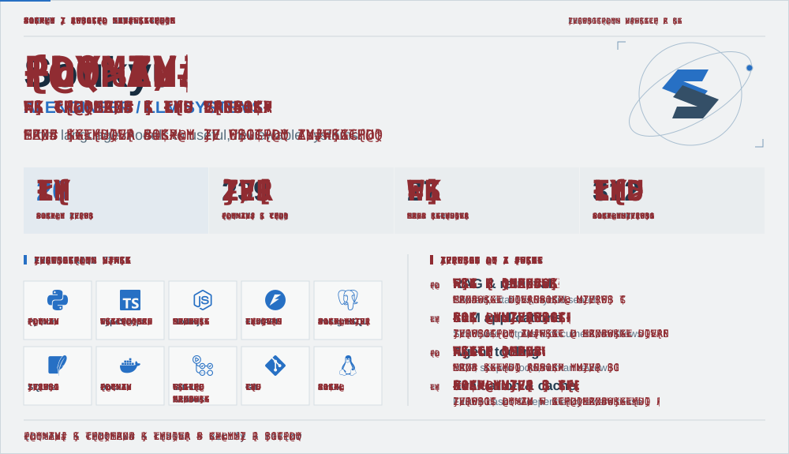
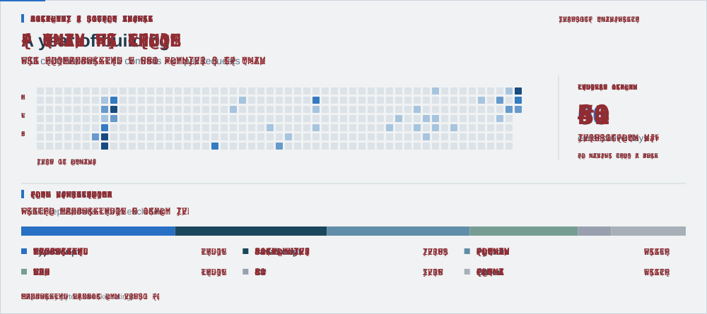
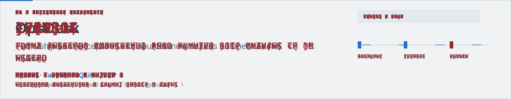
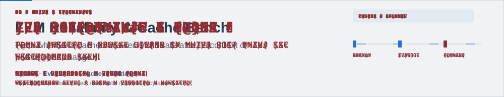
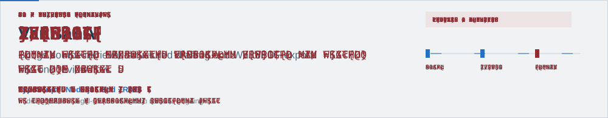

<picture>
  <source media="(max-width: 600px)" srcset="assets/soukyu-console-mobile.svg">
  
</picture>

Repository count: 15 non-fork public repositories (including this profile) + 18 forks = 33 total.

<picture>
  <source media="(max-width: 600px)" srcset="assets/soukyu-activity-mobile.svg">
  
</picture>

<a href="https://github.com/ducanhnguyen223/opsdesk">
<picture>
  <source media="(max-width: 600px)" srcset="assets/soukyu-opsdesk-mobile.svg">
  
</picture>
</a>

<a href="https://github.com/ducanhnguyen223/llm-reliability-bench">
<picture>
  <source media="(max-width: 600px)" srcset="assets/soukyu-bench-mobile.svg">
  
</picture>
</a>

<picture>
  <source media="(max-width: 600px)" srcset="assets/soukyu-vanban-mobile.svg">
  
</picture>

<a href="mailto:ducanhtq88@gmail.com">GET IN TOUCH ↗</a> · <a href="https://github.com/ducanhnguyen223?tab=repositories">EXPLORE REPOSITORIES ↗</a>

Profile as text · evidence & links

## Soukyu / AI Engineer

I build LLM applications around business context, tools and human review.

**Focus:** RAG and retrieval, structured outputs, MCP and scoped tools, evaluation and caching.

**Stack:** Python · TypeScript · Node.js · FastAPI · PostgreSQL · SQLite · Docker · GitHub Actions · Git · Linux.

**Evidence tooling:** [GitHub Profile Audit](https://github.com/ducanhnguyen223/github-profile-audit) — read-only checks for public repository and profile-README consistency, with tests and CI.

**Selected open upstream work, checked 2026-10-08 11:26 ICT (UTC+7)** — status is shown so open work is not mistaken for merged contributions.

| Project / PR | Focus | Live status |
| --- | --- | --- |
| [LangGraphJS #2970](https://github.com/langchain-ai/langgraphjs/pull/2970) | Keep protocol-run auth scoped to the current request; add a concurrent two-identity regression | Open at `cbcca8d`; all 24 reported checks pass · no maintainer review yet · not merged |
| [LlamaIndex #23299](https://github.com/run-llama/llama_index/pull/23299) | Reject non-positive workflow iteration budgets | Open · review required · no checks reported |
| [LlamaIndex #23365](https://github.com/run-llama/llama_index/pull/23365) | Review: lazy imports for RankLLMRerank without vLLM | Open at `eb1c836`; one check passes. Soukyu flagged that construction and execution still reach the vLLM import chain for RankGPT · awaiting author response · no local tests run |
| [NanoCoder #1528](https://github.com/Nano-Collective/nanocoder/pull/1528) | Disclose when LLM summarization falls back | Open · 2/2 reported checks passing (changeset, label) · review required |
| [NanoCoder #1622](https://github.com/Nano-Collective/nanocoder/pull/1622) | Bash completion: suppress subcommands after value-taking flags while retaining enum suggestions | Open · 3/3 GitHub checks passing · review required; not merged |
| [NanoCoder #1623](https://github.com/Nano-Collective/nanocoder/pull/1623) | Preserve literal placeholder-looking text in Markdown responses | Open · 3/3 GitHub checks passing, including automated review · human review required; not merged |
| [mcp-memory-service #1478](https://github.com/doobidoo/mcp-memory-service/pull/1478) | Review: make the Phase 1 event-log batch safe under SQLite lock retries | Open at `5464edc`; Soukyu approved after the real competing-writer retry regression and semantic-dedup-independent connection probe passed hosted checks. 18/19 reported checks pass; External Markdown links is skipped. GitHub still requires review; not merged. Tests were not run locally. Implementation is maintainer-authored |
| [smolagents #2900](https://github.com/huggingface/smolagents/pull/2900) | Review: safe serialization fallback for non-JSON NumPy arrays, including remote-executor coverage | Open · Soukyu approved at `6287979`; independent review reported 4 focused tests passing plus nested `timedelta64`/object-array cases with no issue (remote path was in-process) · no hosted checks, full-suite run or live executor service; overall review still required |
| [smolagents #2899](https://github.com/huggingface/smolagents/pull/2899) | Review: preserve Python `except` semantics for unrelated chained tool errors | Open · Soukyu approved current head `9b5c740`; overall review still required · author reports 17 focused tests and Ruff pass after a style follow-up; no hosted checks |
| [Tokenizers #2462](https://github.com/huggingface/tokenizers/pull/2462) | Preserve ByteLevel `add_prefix_space` during canonicalization | Open at `ee01d75` · review required · no checks reported on current head; a Rust workflow failure was on older head `3b26ac6` |
| [Chroma #7792](https://github.com/chroma-core/chroma/pull/7792) | Review: bound the lifetime of cached Transformers.js embedding pipelines | Open at `62a07f9`; author addressed the pending-load eviction race raised in review and added two delayed-load regressions. At this exact head, 16 focused tests and Prettier pass locally; GitHub reports only Graphite mergeability success, with AI review skipped. No formal review decision or upstream test CI is reported |
| [Chroma #7806](https://github.com/chroma-core/chroma/pull/7806) | Review: hash Unicode BM25 terms as UTF-8 bytes across clients | Open at `6f116b5`; Soukyu reran the focused Jest package suite (7/7 passed) after bypassing a pre-existing frozen-lockfile mismatch, and the author acknowledged the result. No merge or formal approval |
| [LiteLLM #44361](https://github.com/BerriAI/litellm/pull/44361) | Review: keep OpenAI-compatible embedding headers out of request JSON | Open at `02ab784`; all 101 reported checks pass. Soukyu approved this head at 23:22 ICT; overall review is still required from maintainers. Not merged |
| [Chroma #7848](https://github.com/chroma-core/chroma/pull/7848) | Explain embedding-dimension mismatch without assuming its cause | Open · merge-blocked; maintainer comment approves code at `f1159af` and reports focused tests pass; 1 check passed, 2 skipped; no formal review decision |
| [Chroma #7858](https://github.com/chroma-core/chroma/pull/7858) | Remove persisted HNSW data when deleting a collection | Open at `64f9e56`; Soukyu left a non-approval review requesting an already-loaded-cache regression; 2/3 checks pass and Graphite AI Reviews is skipped; no hosted test CI or formal review decision |
| [LangChain #41023](https://github.com/langchain-ai/langchain/pull/41023) | Review: prevent `JumpToToolsMiddleware` from bypassing human approval | Open · latest head `9ae66fb`; 55 checks passed, 2 skipped. Maintainer fixed the middleware-order bypass; Soukyu's follow-up review flags a potentially stale reviewed-call marker when a later model turn reuses a tool-call ID and requests a two-turn regression. Awaiting author response; no formal review decision |
| [Jev RAG #9](https://github.com/aifabrice/jev-rag/pull/9) | Add Windows CLI smoke coverage | Open · head `5092b87` addresses the requested rebase, pins, extras and compile changes; prior CHANGES_REQUESTED decision remains until re-review; awaiting workflow approval · no checks |
| [Ollama Python #712](https://github.com/ollama/ollama-python/pull/712) | Review: preserve tool-call and tool-result IDs through request validation | Open at `621266d` but merge-conflicting; no checks. Soukyu asked whether the API preserves result-side `tool_call_id`; no maintainer response |

Haystack [#12986](https://github.com/deepset-ai/haystack/pull/12986) is not listed as open: the maintainer closed it without merge on 2026-10-01 because it duplicated #13009.

**Merged upstream:** [mcp-memory-service #1334](https://github.com/doobidoo/mcp-memory-service/pull/1334), [#1343](https://github.com/doobidoo/mcp-memory-service/pull/1343) and [#1344](https://github.com/doobidoo/mcp-memory-service/pull/1344), all merged into `main` with maintainer merge commits; [Clinical Deep Research #90](https://github.com/BlueRingsLabs/Clinical-Deep-Research_CDR/pull/90) adds offline regression coverage for long ClinicalTrials.gov query sanitization, [#92](https://github.com/BlueRingsLabs/Clinical-Deep-Research_CDR/pull/92) aligns critique output with the current schema, and [#118](https://github.com/BlueRingsLabs/Clinical-Deep-Research_CDR/pull/118) uses the `SpanStatus.ERROR` enum for Risk of Bias 2 error spans (all merged 2026-09-30 UTC). My [#91](https://github.com/BlueRingsLabs/Clinical-Deep-Research_CDR/pull/91) contribution replaced harness prints with structured logs and regression tests; after maintainer-requested INFO run IDs and WARNING failure hints were added, `make check` passed (661 tests), Ruff and all 7 GitHub checks passed, and the PR merged at `858dc8f` on 2026-10-07 UTC. The maintainer-authored mcp-memory-service Phase 1 [#1470](https://github.com/doobidoo/mcp-memory-service/pull/1470) and Phase 2 [#1471](https://github.com/doobidoo/mcp-memory-service/pull/1471) PRs for #1304 were also merged on 2026-10-07 UTC; neither was authored by me.

**Merged collaborator-fork design contribution (not upstream implementation):** I authored §9 of the v0.4 delta-sync RFC, covering alternatives, migration/bootstrap, backend scope and the first-PR boundary, in [filhocf/mcp-memory-service#4](https://github.com/filhocf/mcp-memory-service/pull/4). The repository maintainer merged that PR at `7babfeb` into `filhocf`'s `doc/rfc-delta-sync-invariants` branch on 2026-10-07.

The upstream tracker [#1345](https://github.com/doobidoo/mcp-memory-service/issues/1345) records the maintainer's acceptance and credit; implementation PR #1478 is maintainer-authored and remains open.

**Review feedback incorporated in upstream work:** In [mcp-memory-service #1449](https://github.com/doobidoo/mcp-memory-service/pull/1449), I flagged that prior search queries could reach the LLM provider and response snapshot; the author added allow-listed fields and regression coverage, and the maintainer merged it. In [LiteLLM #45198](https://github.com/BerriAI/litellm/pull/45198), I identified that a re-read followed by an unconditional cache delete could still erase a sibling worker's newly written session pin. The author replaced it with atomic compare-and-delete (Redis Lua, with an in-memory fallback) and added a regression. In follow-up review comment [#4214362283](https://github.com/BerriAI/litellm/pull/45198#discussion_r4214362283), I noted that the fake callback hardcodes the compare-and-delete behavior instead of executing the production Lua, so removing its model-id predicate could still leave the test green. I requested a predicate-sensitive regression; the PR remains open at `3500bd0` and awaits the author's response. GitHub reports 99 passing checks and 2 failing unit-test jobs. In [Semantic Kernel #14532](https://github.com/microsoft/semantic-kernel/pull/14532), the author adopted my feedback on URL-only `ImageContent`, inferred MIME types, and unsupported SVG/BMP types in commits `7a5b3eb`, `727e1a7`, and `dfe3f5f9`. After my separate dual-source report, the author changed `97c89d7` to prefer inline bytes/data URI over a remote URL and added two regression tests. I ran the full Anthropic chat-completion test file on that exact head with Python 3.12.13: 37 passed (one Pydantic deprecation warning), then posted the evidence in [review #5437049393](https://github.com/microsoft/semantic-kernel/pull/14532#pullrequestreview-5437049393) and submitted an [APPROVED review](https://github.com/microsoft/semantic-kernel/pull/14532#pullrequestreview-5438947900) on the same head. This is review feedback, not code I authored; #14532 remains open and behind its base, and GitHub still marks the PR review-required. Only label and CLA checks are reported, so hosted test CI is not verified. In [LangChain #41023](https://github.com/langchain-ai/langchain/pull/41023), I reported that `JumpToToolsMiddleware` could execute a tool call before human review when middleware order was reversed. The maintainer reproduced it and added execution-time gating plus regression coverage in `be32874`; this is review feedback, not code I authored, and the upstream PR remains open. In [smolagents #2900](https://github.com/huggingface/smolagents/pull/2900), the author added the requested NumPy dtype, safe-only and `RemotePythonExecutor` regression tests in `6287979`. I independently ran the four focused regressions on Python 3.12 and Ruff lint/format on the four changed files; they passed locally, and I submitted an APPROVED review for that head. GitHub still reports no CI checks, the full suite was not run, and the PR remains open and review-required.

The #92 validation also surfaced an invalid mypy override; the separate [CDR #95](https://github.com/BlueRingsLabs/Clinical-Deep-Research_CDR/pull/95) fix corrected it and credits the report from #92.

**Technical discussions and design work:** [Haystack #12969](https://github.com/deepset-ai/haystack/discussions/12969#discussioncomment-18623580) proposes a fail-closed context-budget guard for RAG; [Jev RAG #5](https://github.com/aifabrice/jev-rag/issues/5#issuecomment-5855272663) proposes an opt-in OCR adapter with page-aware citations and explicit privacy boundaries; in [mcp-memory-service #1345](https://github.com/doobidoo/mcp-memory-service/issues/1345#issuecomment-6040181323), RFC author `filhocf` reconciled the proposal to v0.4 and explicitly credited my §8 acceptance invariants and §9 (alternatives, bootstrap/migration, backend scope, first-PR boundary) as co-authored. Fork [RFC PR #4](https://github.com/filhocf/mcp-memory-service/pull/4) was later merged at merge commit `7babfeb` (head `9083146`) into `filhocf`'s `doc/rfc-delta-sync-invariants` branch, not upstream `main`; [#1304](https://github.com/doobidoo/mcp-memory-service/issues/1304) closed after all four phases landed. The maintainer then opened upstream [Phase 1 PR #1478](https://github.com/doobidoo/mcp-memory-service/pull/1478), an opt-in local `sqlite_vec` event log. At head `b6781ee` (checked 2026-10-08 04:13 ICT), the maintainer-authored PR remains open and blocked. The maintainer pushed `7650a06` and `b6781ee` to roll back any leftover transaction before a retry and guard test doubles. Tests cover batch rollback after event-append failure and a failed commit; main tests/coverage, Greptile, and Milvus 2.x/3.x pass, ML-extras remains pending, and external-link checks are skipped. I found no regression test that holds a competing SQLite writer, lets a batch attempt fail, releases the lock, then verifies a retry succeeds. My review [#5448347282](https://github.com/doobidoo/mcp-memory-service/pull/1478#pullrequestreview-5448347282) requested that test. The code remains the maintainer's; my contribution is the co-authored RFC/design work and the reproduced review finding. In [LangChain #41085](https://github.com/langchain-ai/langchain/issues/41085#issuecomment-6030546272), commenters `roydonsequeira` and `0xamlab` supplied transport-level reproductions that `ollama-python`'s `Message` validation drops tool-call/result IDs after LangChain conversion; contributor `keenborder786` agreed the supported `tool_name` mapping is a plausible fix. The issue remains open and unassigned, and related PR #41094 was automatically closed by the assignment gate; Ollama API/model compatibility still needs confirmation.

**mcp-memory-service RFC follow-up (2026-10-08 04:20 ICT):** In issue [#1345](https://github.com/doobidoo/mcp-memory-service/issues/1345), collaborator `filhocf` confirmed v0.4 is pinned on the fork branch and the #1304 phase gate is satisfied. The Phase 1 PR description now lists which write paths emit events and which remain out of scope, making the review boundary explicit.

**Phase 1 review follow-up (2026-10-08 06:54 ICT):** At head `5464edc`, the maintainer-authored regression deterministically exercises the competing-writer SQLite lock/retry path; the final connection probe skips semantic dedup and reports its failure reason. I approved this head after review. The PR remains open and `REVIEW_REQUIRED` for maintainer approval, with 18 checks passing and external-link checking skipped. I did not run the suite locally.

**GitHub contribution snapshot (GraphQL, rechecked 2026-10-08 09:53 ICT / 2026-10-08 02:53 UTC):** 33 owned public repositories total: 15 non-fork repositories including this profile, plus 18 forks; 407 contributions in the exact preceding 365 days, including 259 commits, 61 pull-request contributions, 23 reviews and 2 issues. These are GitHub activity counters, not a count of merged PRs or a skills score. The values match the artwork snapshot below.

The console artwork above reflects the 2026-10-08 09:53 ICT snapshot: 32 other owned public repositories besides this profile, including 18 forks; 259 commits, 61 pull-request contributions and 407 total contributions in the preceding 365 days. The activity/language panel remains a historical 2026-09-28 snapshot. Language shares use bytes from public owned repos, excluding forks and this profile, and are not proficiency scores.

### [OpsDesk](https://github.com/ducanhnguyen223/opsdesk)

Turns shipment exceptions into sourced next actions an operator can review.

Python · FastAPI · SQLite · MCP. Simulated operations · scoped access · human approval.

The separate Agent Gym prototype checks evidence-grounded tool-use proposals against synthetic cases, including policy citations, tenant scope and forbidden-action attempts. It is offline and does not claim live-model quality. [Implementation and limits](https://github.com/ducanhnguyen223/opsdesk/blob/main/docs/AGENT_GYM.md).

### [LLM Reliability & Cache Bench](https://github.com/ducanhnguyen223/llm-reliability-bench)

Tests whether a cached answer is still safe after its context or permissions change.

Python · Evaluation · Cache invalidation. Reproducible cases · exact / semantic / dependency-aware.

### VanBanAI

Brings source retrieval, structured drafting and Word/PDF export into one review flow.

TypeScript · Node.js · Zod · RAG. In development · legal-source validation remains ongoing.

[Email](mailto:ducanhtq88@gmail.com) · [Repositories](https://github.com/ducanhnguyen223?tab=repositories)

