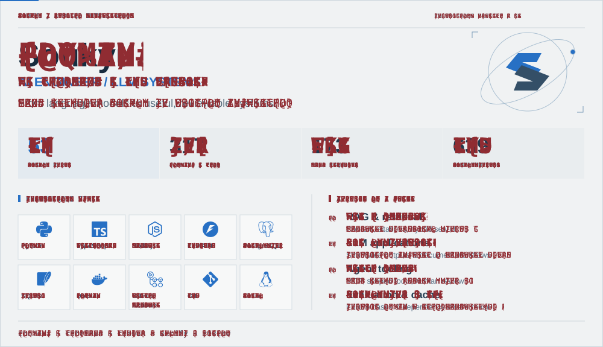
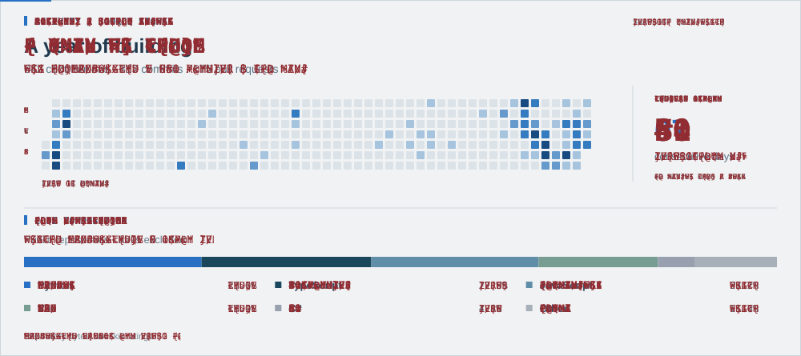
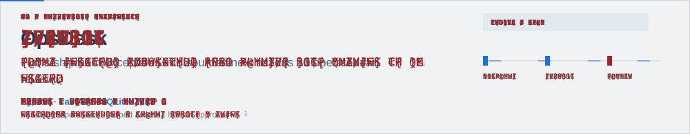
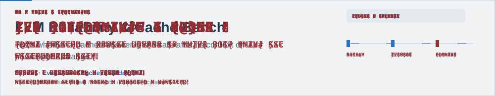
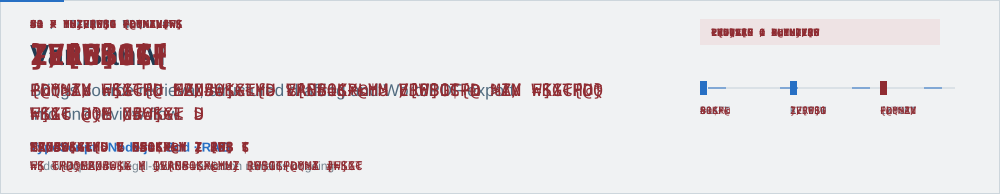

<picture>
  <source media="(max-width: 600px)" srcset="assets/soukyu-console-mobile.svg">
  
</picture>

User-owned public-repository inventory (live check 2026-11-12 02:52 ICT): 16 non-fork repositories (including this profile) + 36 forks = 52 total.

**GitHub contribution snapshot (GraphQL, rechecked 2026-11-12 02:52 ICT / UTC window 2025-11-11T19:52:25Z–2026-11-11T19:52:25Z):** 52 owned public repositories total: 16 non-fork public repositories including this profile, plus 36 forks; 626 contributions in the exact preceding 365 days, including 316 commits, 162 pull-request contributions, 52 reviews and 2 issues. 41 contributions are from restricted repositories.

<picture>
  <source media="(max-width: 600px)" srcset="assets/soukyu-activity-mobile.svg">
  
</picture>

<a href="https://github.com/ducanhnguyen223/opsdesk">
<picture>
  <source media="(max-width: 600px)" srcset="assets/soukyu-opsdesk-mobile.svg">
  
</picture>
</a>

<a href="https://github.com/ducanhnguyen223/llm-reliability-bench">
<picture>
  <source media="(max-width: 600px)" srcset="assets/soukyu-bench-mobile.svg">
  
</picture>
</a>

<picture>
  <source media="(max-width: 600px)" srcset="assets/soukyu-vanban-mobile.svg">
  
</picture>

<a href="mailto:ducanhtq88@gmail.com">GET IN TOUCH ↗</a> · <a href="https://github.com/ducanhnguyen223?tab=repositories">EXPLORE REPOSITORIES ↗</a>

Profile as text · evidence & links

## Soukyu / AI Engineer

I build LLM applications around business context, tools and human review.

**Focus:** RAG and retrieval, structured outputs, MCP and scoped tools, evaluation and caching.

**Stack:** Python · TypeScript · Node.js · FastAPI · PostgreSQL · SQLite · Docker · GitHub Actions · Git · Linux.

**Evidence tooling:** [GitHub Profile Audit](https://github.com/ducanhnguyen223/github-profile-audit) — read-only checks for public repository and profile-README consistency, with tests and CI.

### Selected upstream contributions

**Verified merged PRs (live search rechecked 2026-11-12 02:52 ICT): 44 across ten selected upstream projects** — 15 in [mcp-memory-service](https://github.com/doobidoo/mcp-memory-service), 9 in [Clinical Deep Research](https://github.com/BlueRingsLabs/Clinical-Deep-Research_CDR), 6 in [NanoCoder](https://github.com/Nano-Collective/nanocoder), 3 in [Shoal](https://github.com/Dangalcan/shoal), 5 in [Open Source Radar](https://github.com/TanbirRamim/open-source-radar), 1 in [W&B RAI Toolkit](https://github.com/wandb/rai-toolkit), 1 in [tox](https://github.com/tox-dev/tox), 1 in [REA](https://github.com/morluto/rea), 1 in [Provena](https://github.com/rajfirke/provena), and 2 in [Rasbur](https://github.com/omanshchoudhary/rasbur). Counts are authored PRs returned as merged by GitHub for the named projects; they exclude review-only contributions and other repositories.

**External selection:** The live [XERJ Corpus Hub contributor page](https://hub.xerj.org/contributors/ducanhnguyen223) lists merged [mcp-memory-service #1534](https://github.com/doobidoo/mcp-memory-service/pull/1534) as a worked reference: one corpus and selected commit, 10 files / 1,580 lines, under the repository's Apache-2.0 licence. XERJ marks the corpus live and the licence cleared; inclusion is with the author's permission.

- **[Open Source Radar #169](https://github.com/TanbirRamim/open-source-radar/pull/169) — merged.** Added a Vue 3/Vite quickstart with setup and common install, dev, test, type-check, lint and build commands; linked it from the language index and updated the README quickstart count. The local script suite passed **96 tests**, all **6 hosted checks passed**, and maintainer `TanbirRamim` merged it at [`b5dc243`](https://github.com/TanbirRamim/open-source-radar/commit/b5dc24313caa97dfd25075798122c6d5762d1be7) on 2026-10-16; issue [#140](https://github.com/TanbirRamim/open-source-radar/issues/140) closed as completed.
- **[Open Source Radar #367](https://github.com/TanbirRamim/open-source-radar/pull/367) — merged.** Added Jupyter and HTML/CSS quickstarts, indexed both guides, and closed issues [#221](https://github.com/TanbirRamim/open-source-radar/issues/221) and [#222](https://github.com/TanbirRamim/open-source-radar/issues/222). The local script suite passed **126 tests**, all **9 hosted checks passed**, and it merged at [`75f2bf3`](https://github.com/TanbirRamim/open-source-radar/commit/75f2bf3547bac02e48fc39c1abaa23e5802d6a37) on 2026-10-30.
- **[Open Source Radar #407](https://github.com/TanbirRamim/open-source-radar/pull/407) — merged.** Added the Vietnamese translation of guide chapter 1 and a Vietnamese guide index linking untranslated chapters to English; the PR disclosed AI assistance. All **10 hosted checks passed**. Maintainer `TanbirRamim` merged it on 2026-11-03 02:07 ICT at [`68325b8`](https://github.com/TanbirRamim/open-source-radar/commit/68325b8f25580574eee8bcbc8fe1cb3783160886), closing issue [#384](https://github.com/TanbirRamim/open-source-radar/issues/384). In maintainer-authored follow-up [#413](https://github.com/TanbirRamim/open-source-radar/pull/413), the Vietnamese site locale now links to `guide/vi`, and the upstream README credits `@ducanhnguyen223`; #413 is not counted as an authored PR.
- **[Open Source Radar #422](https://github.com/TanbirRamim/open-source-radar/pull/422) — merged.** Adds the Vietnamese translation of guide chapter 2, links it from the Vietnamese index, and updates the English index count. The repository test caught chapter 1 still linking to the English setup chapter; head `b922276` fixes that localized next-chapter link. All **148 local unit tests** passed on Python 3.14.6 and all **9 hosted checks** passed. Maintainer `TanbirRamim` merged it on 2026-11-04 04:28 ICT at [`0fa36ee`](https://github.com/TanbirRamim/open-source-radar/commit/0fa36eeaee13e245f171d889c396c65f05f432d9); later, maintainer-authored [#423](https://github.com/TanbirRamim/open-source-radar/pull/423) merged a public contributor credit for the Vietnamese guide chapters (not an authored PR).
- **[LangGraphJS #3165](https://github.com/langchain-ai/langgraphjs/pull/3165) — maintainer-merged follow-up, not an authored PR.** Author `eliornl` fixed [#2958](https://github.com/langchain-ai/langgraphjs/issues/2958) so thread-protocol commands use the current request's auth instead of reusing the first request's potentially expired token. The PR description credits `ducanhnguyen223`'s issue and #2970 analysis; a regression interleaves requests with different tokens on one thread. Maintainer `hntrl` approved the merged head; **29 hosted checks passed**. Merged on 2026-11-05 ICT at [`b2c3d0b`](https://github.com/langchain-ai/langgraphjs/commit/b2c3d0b2a7cfe6e9e8a4944840d75835ee9ae4ee).
- **[NanoCoder #1528](https://github.com/Nano-Collective/nanocoder/pull/1528) — merged.** Fixed assigned issue [#1518](https://github.com/Nano-Collective/nanocoder/issues/1518): when LLM summarization fails, compaction now labels the mechanical fallback as degraded. Reviewer `addyCooks` approved it; all 17 hosted checks passed, and it merged at [`87d8159`](https://github.com/Nano-Collective/nanocoder/commit/87d8159ae1dd681c29457f97304a3a54f2c5363d).
- **[NanoCoder #1760](https://github.com/Nano-Collective/nanocoder/pull/1760) — merged.** Rejects unknown top-level CLI flags and commands with close-match suggestions while leaving `run` prompt text free-form. All 18 hosted checks passed; maintainer `akramcodez` merged it on 2026-10-15 at [`e313d50`](https://github.com/Nano-Collective/nanocoder/commit/e313d50eb5f775732e8905f77fc59fa84e9c2da1).
- **[NanoCoder #1623](https://github.com/Nano-Collective/nanocoder/pull/1623) — merged.** Preserves literal placeholder-looking text in Markdown responses using exact marker matching, with an entity-decoded collision regression. All 17 hosted checks passed; maintainer `akramcodez` merged it on 2026-10-15 at [`ddce40f`](https://github.com/Nano-Collective/nanocoder/commit/ddce40f431b3813765e1b6c82339839d92458b84).
- **[mcp-memory-service #1534](https://github.com/doobidoo/mcp-memory-service/pull/1534) — merged.** Implemented assigned issue [#1502](https://github.com/doobidoo/mcp-memory-service/issues/1502), preserving remote tombstone ordering so an older remote deletion cannot override a newer unsynced peer save; maintainer `doobidoo` merged it into `main` at [`ca46032`](https://github.com/doobidoo/mcp-memory-service/commit/ca46032e5844c49310e20f8fb89dc13d8b22026f).
- **[mcp-memory-service #1542](https://github.com/doobidoo/mcp-memory-service/pull/1542) — merged.** Implemented assigned issue [#1538](https://github.com/doobidoo/mcp-memory-service/issues/1538), adding explicit per-hash `keep_local` / `accept_delete` resolution for hybrid tombstone conflicts. Maintainer `doobidoo` approved and merged it at [`a2e53c6`](https://github.com/doobidoo/mcp-memory-service/commit/a2e53c6e76ad0a1b3e7861ca3d5012a5b301b96a); 17 hosted checks passed and External Markdown links was skipped.
- **[mcp-memory-service #1550](https://github.com/doobidoo/mcp-memory-service/pull/1550) — merged.** Replaced five dashboard inline click handlers with registered event listeners; the linked issue [#1549](https://github.com/doobidoo/mcp-memory-service/issues/1549) was closed by the maintainer on 2026-10-15 after the fix merged. The maintainer merged it at [`f6bec0a`](https://github.com/doobidoo/mcp-memory-service/commit/f6bec0a6a238f70a2ebdeece48b1d073e09afd5f); **18 hosted checks passed and External Markdown links was skipped**.
- **[mcp-memory-service #1561](https://github.com/doobidoo/mcp-memory-service/pull/1561) — merged.** Implemented assigned issue [#1547](https://github.com/doobidoo/mcp-memory-service/issues/1547) with page-specific Content Security Policy for the dashboard, API overview and SSE test page. At final head `3b8b0f1`, the web suite passed **229 tests** locally; GitHub reports **20 checks passed and 1 external-link check skipped**. Maintainer `doobidoo` merged it at [`df3af0d`](https://github.com/doobidoo/mcp-memory-service/commit/df3af0d112f4ae21d405808a0cdbb78ba55e4cf8) on 2026-10-16; issue #1547 closed immediately after.
- **[mcp-memory-service #1563](https://github.com/doobidoo/mcp-memory-service/pull/1563) — merged.** Scoped semantic duplicate detection to the requested store while keeping exact content hashes globally unique, addressing assigned issue [#1517](https://github.com/doobidoo/mcp-memory-service/issues/1517). At final head `dc3bc89`, `tests/storage` passed **507 tests** (15 skipped, 3 xfailed); **17 hosted checks passed** and external-link checking was skipped. Maintainer `doobidoo` merged it at [`f572cee`](https://github.com/doobidoo/mcp-memory-service/commit/f572cee44edb5550198068aeca408ba2da21bc1a) on 2026-10-16; issue #1517 was closed after merge.
- **[NanoCoder #1622](https://github.com/Nano-Collective/nanocoder/pull/1622) — merged.** Fixed Bash completion for assigned issue [#1593](https://github.com/Nano-Collective/nanocoder/issues/1593), where a value-taking flag fell through to subcommand suggestions; merged by the maintainer after focused CLI regression coverage.
- **[Clinical Deep Research #91](https://github.com/BlueRingsLabs/Clinical-Deep-Research_CDR/pull/91) — merged.** Replaced diagnostic prints with structured logging and regression tests; updated from maintainer feedback before merge.
- **[Clinical Deep Research #131](https://github.com/BlueRingsLabs/Clinical-Deep-Research_CDR/pull/131) — merged.** Made the retrieval package mypy-clean, adopted the current Qdrant query API, and added an in-memory Qdrant lifecycle regression for issue [#79](https://github.com/BlueRingsLabs/Clinical-Deep-Research_CDR/issues/79). The maintainer merged it at [`969fc2a`](https://github.com/BlueRingsLabs/Clinical-Deep-Research_CDR/commit/969fc2a91b932587a8266421eb031749b0dc8cc9); issue #79 remains open.
- **[Clinical Deep Research #132](https://github.com/BlueRingsLabs/Clinical-Deep-Research_CDR/pull/132) — merged.** Migrated the Anthropic provider paths to SDK 1.x with model-compatible sampling, refusal/truncation handling, and fake-server regressions. After responding to maintainer `glromero`'s wire-level review, the final head passed **714 tests** and **7 hosted checks**; it was merged at [`5e61fd3`](https://github.com/BlueRingsLabs/Clinical-Deep-Research_CDR/commit/5e61fd39061c476f6825b8e2cabc99d393e308fc).
- **[Clinical Deep Research #135](https://github.com/BlueRingsLabs/Clinical-Deep-Research_CDR/pull/135) — merged.** Replaced synthesis-node console output with severity-aware logging and regression tests for routine and degraded paths. At final head `5dfae30`, `make check` passed **714 tests** and all **8 hosted checks passed**; merged at [`c5f2707`](https://github.com/BlueRingsLabs/Clinical-Deep-Research_CDR/commit/c5f270777efa06b713050c5c9f80d5033921ad47). The advisory type-check job reported 234 mypy errors across 42 files; attribution to this PR was not established.
- **[mcp-memory-service #1486](https://github.com/doobidoo/mcp-memory-service/pull/1486) — merged.** Implemented assigned issue [#1484](https://github.com/doobidoo/mcp-memory-service/issues/1484), splitting search-handler stages and adding a complexity-budget regression.
- **[tox #4302](https://github.com/tox-dev/tox/pull/4302) — merged.** Fixes [#4251](https://github.com/tox-dev/tox/issues/4251) by keeping malformed configuration bytes out of `tox config` diagnostics while retaining the decode position. The focused config test file passed **36 tests** locally; GitHub currently shows four macOS test legs failed and the workflow run cancelled, so hosted CI is not described as green. It merged at [`19f1765`](https://github.com/tox-dev/tox/commit/19f176502102d01fb0dac1705a5d5bca5ccedbcd) on 2026-10-30.

### Selected current and recently merged upstream work
- **[Clinical Deep Research #149](https://github.com/BlueRingsLabs/Clinical-Deep-Research_CDR/pull/149) — open, review pending; not merged.** Addresses [issue #4](https://github.com/BlueRingsLabs/Clinical-Deep-Research_CDR/issues/4) with examples for run creation/status/report/export and health, including a clearly synthetic PICO-style question; regenerates `docs/openapi.json`. At head `1d59eb4`, the PR records `make check` (**729 tests**) and **23 OpenAPI-spec tests** passing; all **8 hosted checks pass**. No human review or merge is recorded.
- **[NanoCoder #2156](https://github.com/Nano-Collective/nanocoder/pull/2156) — open, review pending; not merged.** Fixes [issue #2011](https://github.com/Nano-Collective/nanocoder/issues/2011) by bounding lifecycle-hook context for tool arguments, paths, commands and prompts; truncation is marked, and vetoing hooks fail closed when full context is unavailable. At head `fc55dce`, the focused AVA file passed **57 tests** and local type, format and lint checks passed. **18 checks succeeded; automated `nc-review` remains in progress.** No human review is recorded.
- **[Rasbur #15](https://github.com/omanshchoudhary/rasbur/pull/15) — merged.** Updated the anonymous decode Playwright test for the redesigned landing page and workspace; the PR reports build/test success and two passing Chromium E2E cases. Merged on 2026-11-08 at [`64caf15`](https://github.com/omanshchoudhary/rasbur/commit/64caf158315f67775ef8f8a7ce94a4efbb3ae789).
- **[Rasbur #14](https://github.com/omanshchoudhary/rasbur/pull/14) — merged.** Adjusted automatic decoder selection so readable byte-aligned binary wins over ambiguous bit-hash classification while preserving hash identification. The PR reports 122 passing tests and a successful build on Node 24.22.1; merged on 2026-11-07 at [`c25354d`](https://github.com/omanshchoudhary/rasbur/commit/c25354d4b45b389b0306134cecfa08efd6ae80ee).
- **[Avogadro #266](https://github.com/Avogadro/two.avogadro.cc/pull/266) — open, review pending.** Adds descriptive alt text to the MMFF94 force-field screenshot on the [Force Fields page](https://github.com/Avogadro/two.avogadro.cc/blob/main/source/docs/optimizing-geometry/force-fields.md), identifying the water cluster and dashed hydrogen bonds. At head `1085c34`, `git diff --check` passed and the Sphinx HTML build succeeded with unrelated Doxygen/toctree warnings; the rendered page contains the new `alt`. CodeRabbit was skipped; no human review or substantive CI result is reported. The PR is not merged.
- **[mcp-memory-service #1714](https://github.com/doobidoo/mcp-memory-service/pull/1714) — closed without merge.** This store-boundary follow-up did not land; issue [#1683](https://github.com/doobidoo/mcp-memory-service/issues/1683) remains OPEN and is assigned to maintainer `doobidoo`, not `ducanhnguyen223` (live check 2026-11-11).
- **[mcp-memory-service #1715](https://github.com/doobidoo/mcp-memory-service/pull/1715) — merged.** Fixes assigned issue [#1705](https://github.com/doobidoo/mcp-memory-service/issues/1705) by preventing a saved dark dashboard theme from flashing light on reload. At final head `fe945b3`, **21 hosted checks passed and 2 were skipped**. Maintainer `doobidoo` approved and merged it at [`d3e6b5a`](https://github.com/doobidoo/mcp-memory-service/commit/d3e6b5aa1fa2ce0ff625a06855b145a76b66da9b) on 2026-11-04 04:47 ICT; issue #1705 closed immediately after.
- **[mcp-memory-service #1716](https://github.com/doobidoo/mcp-memory-service/pull/1716) — merged by maintainer `doobidoo`.** Added opt-in contextual capture for short replies and their preceding assistant answers; the merged commit is [`0ea3701`](https://github.com/doobidoo/mcp-memory-service/commit/0ea3701b555dfc30e33dc22588d44e18299830c0) (2026-11-06).
- **[mcp-memory-service #1842](https://github.com/doobidoo/mcp-memory-service/pull/1842) — merged by maintainer `doobidoo`.** Adds teardown isolation for the cached semantic-dedup setting in assigned issue [#1837](https://github.com/doobidoo/mcp-memory-service/issues/1837). The targeted command passed **11 tests**, using the hash-embedding fallback because the ONNX model was unavailable; this did not reproduce the original semantic-similarity failure locally. On final head `d6d2fe6`, **19 hosted checks passed and 3 were skipped** (Milvus, Docker and External Markdown links). Maintainer `doobidoo` merged it at [`8b91299`](https://github.com/doobidoo/mcp-memory-service/commit/8b91299b6d1dcea94a8b110570d6ab214e6eb70e) on 2026-11-04 13:16 ICT, and issue #1837 closed as completed.
- **[mcp-memory-service #1850](https://github.com/doobidoo/mcp-memory-service/pull/1850) — merged by maintainer `doobidoo`.** Fixes assigned issue [#1838](https://github.com/doobidoo/mcp-memory-service/issues/1838): versioned updates exclude their own parent hash during conflict checks while retaining real conflicts with other memories and preserving the reported conflict count. At final head `870c3df`, focused conflict tests passed **11/11** and related suites passed **169 tests, 4 skipped**; all visible hosted checks passed except External Markdown links, which was skipped. The maintainer merged it on 2026-11-04 at [`151f7a6`](https://github.com/doobidoo/mcp-memory-service/commit/151f7a67b671f30c9feec4a9c68530005184dac2); issue #1838 closed immediately after.
- **[AIRI #3346](https://github.com/moeru-ai/airi/pull/3346) — open, not merged.** Fixes [issue #3345](https://github.com/moeru-ai/airi/issues/3345): preserve the grapheme after an empty-buffer period while retaining dot-prefixed tokens. Two more regressions reproduce the dropped punctuation in `Hmm!..No way.` and `Hmm!...No way.`; `.NET`, `.5`, and special-token handling remain covered. At head `02292d7`, the full `@proj-airi/pipelines-audio` suite passed **93/93**, and package typecheck, build, and repository lint passed (0 errors, 683 warnings). GitHub shows **two metadata checks passed**, no hosted package tests, and GitHub reports mergeability UNKNOWN (not a blocked decision); two review records are COMMENTED, with no formal review decision.
- **[AIRI #3372](https://github.com/moeru-ai/airi/pull/3372) — open, not merged.** Fixes [issue #3359](https://github.com/moeru-ai/airi/issues/3359) by importing filesystem-selected plugin entrypoints through file URLs. At head `04cb31f`, GitHub reports OPEN/BEHIND with no formal review decision. Rechecked 2026-11-05 02:12 ICT: two checks passed; `Human Attestation` is ACTION_REQUIRED (not a failure) and all three review records are COMMENTED only. Windows desktop execution remains unverified on this macOS host.
- **[FitBenchmarking #1827](https://github.com/fitbenchmarking/fitbenchmarking/pull/1827) — open, review required.** Corrects misspelled minimizer identifiers through callers, options and results rendering; fixes [issue #1821](https://github.com/fitbenchmarking/fitbenchmarking/issues/1821). At head `fdfd223`, focused tests passed **95 tests**, two controller tests passed, and the default unit suite passed **871 tests with 119 skipped**. Ruff, spelling, formatting and diff checks passed; both hosted checks pass. Not merged.
- **[Provena #246](https://github.com/rajfirke/provena/pull/246) — merged by repo owner Raj Vijay Firke.** Fixes [issue #243](https://github.com/rajfirke/provena/issues/243) by hashing full context while preserving the truncation flag. After the maintainer-requested version marker, legacy-row documentation, changelog placement and v1 truncated-row regression were added, the owner merged it at [`3090934`](https://github.com/rajfirke/provena/commit/3090934be92a44accfd531f010465cb01cf4b3e1) on 2026-11-12 02:12 ICT. Final local suite: **692 passed, 41 skipped**; hosted build and Python 3.10–3.13 tests passed.
- **[Provena #261](https://github.com/rajfirke/provena/pull/261) — open, maintainer re-review pending.** The follow-up corrects `docs/guide/testing.md`: `ContextTrail.close()` reports pending records through the governance error path and always closes the backend, so the closed trail cannot retry them. At head `492119b`, local pytest passed **692 tests, 41 skipped**, with Ruff, formatting and full mypy passing; hosted build and Python 3.10–3.13 tests pass (docs deploy skipped). GitHub reports `CLEAN`/`MERGEABLE`, but the PR remains `CHANGES_REQUESTED` and is not merged.
- **[Shoal #103](https://github.com/Dangalcan/shoal/pull/103) — merged.** Adds accessible action-specific names and role/name regression tests for three controls, addressing [issue #99](https://github.com/Dangalcan/shoal/issues/99). All **6 hosted checks passed**; maintainer `Dangalcan` merged it on 2026-11-03 at [`cfce6e0`](https://github.com/Dangalcan/shoal/commit/cfce6e0cc93957bce85452a48ac4ca7476990cc1), and issue #99 closed.
- **[Shoal #107](https://github.com/Dangalcan/shoal/pull/107) — merged.** Pauses periodic auto-refresh while the document is hidden and refreshes once when visible, addressing [issue #97](https://github.com/Dangalcan/shoal/issues/97). All **6 hosted checks passed**; maintainer `Dangalcan` merged it on 2026-11-03 at [`d20d613`](https://github.com/Dangalcan/shoal/commit/d20d613b866006b342d2e67e648e3272ef4db03e), and issue #97 closed.
- **[Shoal #108](https://github.com/Dangalcan/shoal/pull/108) — merged.** Implements [issue #100](https://github.com/Dangalcan/shoal/issues/100): renders Resource, ContainerResource, Pods, Object and External HPA metrics, truncates after two values with a remainder count, and sorts by the first metric's current value. At approved head `0937474`, all **3,137 local tests passed and 1 was skipped**, and **all 6 hosted checks passed**; maintainer `Dangalcan` confirmed it matches kubectl for all five metric types and merged it at [`e2161d9`](https://github.com/Dangalcan/shoal/commit/e2161d99bc54e35a04f011017525009b5378bf08) on 2026-11-03; issue #100 closed.
- **[FitBenchmarking #1813](https://github.com/fitbenchmarking/fitbenchmarking/pull/1813) — open, draft.** Adds finite- and infinite-minimum tests for `FittingResult.norm_energy`, addressing [issue #1808](https://github.com/fitbenchmarking/fitbenchmarking/issues/1808). The target test file passes **76 tests** locally and all **12 hosted checks pass**. Review is required; GitHub currently reports `BEHIND` main. Not merged.
- **[FitBenchmarking #1822](https://github.com/fitbenchmarking/fitbenchmarking/pull/1822) — open, not merged.** Improves the options-file error for unknown sections and suggests a close valid name; addresses [issue #1820](https://github.com/fitbenchmarking/fitbenchmarking/issues/1820). The full `test_options_*.py` suite passes **141 tests**; Ruff check/format and `git diff --check` pass. Rechecked 2026-11-05 02:12 ICT: GitHub reports BEHIND/REVIEW_REQUIRED and both hosted checks pass.
- **[REA #8902](https://github.com/morluto/rea/pull/8902) — open, draft.** Fixes [issue #8891](https://github.com/morluto/rea/issues/8891) by disclosing `inspect_macho` temporary filesystem writes for supported parenthesized filenames; target mutation remains false. On Darwin arm64 / macOS 26.4.1 with Node 24.22.1, the self-compiled Mach-O reproduction confirmed the CLI effect, plain-name control, expected `app(foo)` failure under a read-only temp parent, successful retry after restoring permissions, alias cleanup, and unchanged target bytes. Focused tests passed **17/17**; `npm run check` completed with 0 errors and `npm run docs:check` passed. GitHub shows Greptile and author-declaration checks passing; PR readiness remains pending because this is a draft. No human maintainer review or merge is recorded; owner-readiness declarations remain unchecked.
- **[REA #7870](https://github.com/morluto/rea/pull/7870) — merged.** Rejects malformed CLI `--dry-run` literals before setup or environment publication can mutate state, while preserving supported forms. The PR reports **40 focused tests passing** and merged on 2026-11-07 at [`48f5f30`](https://github.com/morluto/rea/commit/48f5f30fd5536cb783c74c1a2df7c2003689dbd0); it fixes [issue #7540](https://github.com/morluto/rea/issues/7540).
- **[REA #7518](https://github.com/morluto/rea/pull/7518) — closed without merge on 2026-11-11.** This draft for [issue #7501](https://github.com/morluto/rea/issues/7501) did not land; no upstream fix or maintainer acceptance is claimed.
- **[REA #7317](https://github.com/morluto/rea/pull/7317) — open, draft.** Fixes [issue #7315](https://github.com/morluto/rea/issues/7315): accept valid FDT v16/v17 files when the strings block has zero length and begins at the reservation map. The focused parser/compiled-CLI/MCP suite (**39/39**), `check:fast` (**2/2**) and formatting passed on earlier head `0095ae0` only; the live head is now `6d26254` after a maintainer-authored commit and has not been re-tested by Soukyu. PR base is `9842299` and current `main` is `1ff5a65`; it remains OPEN/DRAFT with two checks passing, one cancelled, and readiness pending. No human maintainer review or merge is recorded.
- **[mcp-memory-service #1665](https://github.com/doobidoo/mcp-memory-service/pull/1665) — merged by maintainer `doobidoo`.** Implements the maintainer-approved design for assigned issue [#1505](https://github.com/doobidoo/mcp-memory-service/issues/1505): negotiate peer protocol, event-schema and embedding compatibility before scheduled delta-sync, including a clear legacy-peer 404 result. After maintainer feedback, the follow-up split the requested complexity hotspots, added the `/api/health/model` hash-fallback changelog note, and replied to review threads with test evidence; all three review threads are resolved. At final head `59a3e88`, **19 hosted checks passed and 1 External Markdown links check was skipped**. Maintainer `doobidoo` merged it into `main` at [`5d4139b`](https://github.com/doobidoo/mcp-memory-service/commit/5d4139b0ae9305258b18fe685e8a9a84cf9de9e5) on 2026-10-25 03:26 ICT; issue #1505 closed immediately after.
- **[mcp-memory-service #1663](https://github.com/doobidoo/mcp-memory-service/pull/1663) — merged by maintainer `doobidoo`.** Implemented assigned issue [#1556](https://github.com/doobidoo/mcp-memory-service/issues/1556), exposing Delta-Sync settings in the Environment tab while keeping the settings read-only and secrets masked. After Greptile identified that `MCP_SYNC_EVENTLOG=on/1` appeared disabled, commit [`06325eb`](https://github.com/doobidoo/mcp-memory-service/commit/06325ebf0e406e2f0c5068c6ca6e650ef4182c49) changed the display-only field to a string and added regression coverage for both values. The API suite passed **129 tests** locally; a JavaScript smoke test confirmed literal rendering and HTML escaping. **18 hosted checks passed; 2 were skipped.** Greptile automatically approved the exact head and its P2 thread is resolved/outdated; maintainer `doobidoo` merged it on 2026-10-23 at [`441e0ee`](https://github.com/doobidoo/mcp-memory-service/commit/441e0ee1a17be3d51cf12a2d7d2a936cee69aded), closing assigned issue #1556. This is an authored code contribution.
- **[Open Source Radar #175](https://github.com/TanbirRamim/open-source-radar/pull/175) — merged.** Implements issue [#139](https://github.com/TanbirRamim/open-source-radar/issues/139) with a Nix quickstart linked from the language index. The local script suite passed **96 tests**; the maintainer merged it on 2026-10-16 at [`b31a101`](https://github.com/TanbirRamim/open-source-radar/commit/b31a101c08e811a977267b2081e8ad928d98bf0d), and closed issue #139 as completed.
- **[Clinical Deep Research #136](https://github.com/BlueRingsLabs/Clinical-Deep-Research_CDR/pull/136) — merged.** Preserves PubMed publication labels and normalized study design without over-classifying ambiguous tags. The maintainer tested against 81 PubMed records; the final branch caught 23 prior false positives and classified 8 genuine RCTs that the previous path missed. At final head `90e7307`, `make check` passed (**719 tests**) and all **7 hosted checks passed**; maintainer `glromero` merged it on 2026-10-17 at [`c9a1a27`](https://github.com/BlueRingsLabs/Clinical-Deep-Research_CDR/commit/c9a1a27f90515bbec3baea73e64a77cdd644a4fa).
- **[W&B RAI Toolkit #117](https://github.com/wandb/rai-toolkit/pull/117) — merged.** Repairs the documented enterprise policy pack for issue [#116](https://github.com/wandb/rai-toolkit/issues/116): consolidates both policies into a schema-valid `PolicySet`, corrects the CLI/schema documentation, and adds offline regression coverage. At head `127733a`, the full suite passed **716 tests locally** with **16 skipped**; Ruff, formatting, dependency, REUSE and diff checks passed, as did both hosted Socket checks. Maintainer `knisar` merged it on 2026-10-16 at [`371332d`](https://github.com/wandb/rai-toolkit/commit/371332d47e631d1845e0b4d716b1037e0bd73722).
- **[NanoCoder #1787](https://github.com/Nano-Collective/nanocoder/pull/1787) — open, review required.** Addresses issue [#1776](https://github.com/Nano-Collective/nanocoder/issues/1776): defer loading `cli-highlight` and its parser dependencies until highlighted output is rendered. At head `529a4f1`, the patch changeset and isolated lazy-load regression are included; **all 17 hosted checks pass**, including Unit Tests & Coverage Analysis. Local `pnpm run test:all` still reports 52 failures, including CLI child-process `ink` export resolution and macOS temporary-path assumptions; focused tests for the changed paths passed. Code-owner review is pending; not merged.
- **[NanoCoder #1794](https://github.com/Nano-Collective/nanocoder/pull/1794) — open, review required.** Fixes assigned issue [#1774](https://github.com/Nano-Collective/nanocoder/issues/1774): make LSP discovery non-blocking, add a discovery opt-out and deduplicate verification by executable. After maintainer `addyCooks` requested fresh PATH snapshots and regressions, the branch was synchronized with upstream through `27e56ee` and pushed at `71627b2`. On this head, the focused LSP/config AVA suite passed **232 tests** (6 Windows-only skipped on macOS), and build, TypeScript, format and all hosted checks pass. Three human reviews remain requested; the latest REST refresh returned mergeability `UNKNOWN`, with no human review or merge recorded.
- **[NanoCoder #1880](https://github.com/Nano-Collective/nanocoder/pull/1880) — open; reviewer-approved, not merged.** Addresses assigned issue [#1631](https://github.com/Nano-Collective/nanocoder/issues/1631): preserve XML tool calls around ordinary fenced code examples. After the `nc-review` bot flagged calls before a fence, commits `d245be1` and `04df843` added prefix handling plus plain and wrapper-wrapped regressions; both parser suites pass **120/120** locally at exact head `04df843`, and **all 18 hosted checks pass**. GitHub reports `APPROVED` by reviewer `addyCooks`; no merge.
- **[NanoCoder #1758](https://github.com/Nano-Collective/nanocoder/pull/1758) — open.** Isolates agent-evaluation runs from user preferences and unrelated provider/MCP configuration; 29 focused tests pass. Head `15936fa` is based on upstream `main` `4ec94e5`; **all 17 hosted checks pass** and GitHub reports it mergeable, but blocked pending review. Issue [#1744](https://github.com/Nano-Collective/nanocoder/issues/1744) is now assigned to `ducanhnguyen223`; three code-owner reviews are requested, with no human review or merge visible. A maintainer's Nov 3 reminder asks that future issues be claimed before opening a PR.
- **[NanoCoder #1645](https://github.com/Nano-Collective/nanocoder/pull/1645) — closed without merge.** After my `CHANGES_REQUESTED` reproduction on old head `c977222`, author `qwist1233-cpu` pushed `0311528`, preserving a short failure line alongside its context. On that exact head, the focused AVA file passes **33/33**, `pnpm run test:types` passes, and Biome passes on both changed files. I approved the exact head after verifying that the original failure detail survives compaction. My APPROVED review and the 33/33 local run were for head `0311528` before closure.
- **[smolagents #2921](https://github.com/huggingface/smolagents/pull/2921) — open.** Review identified repeated truth-testing of stateful chained-comparison results; the author added a regression and updated the fix. Soukyu approved the exact updated head after the focused 45-test class passed; maintainer review remains pending.
- **[smolagents #2965](https://github.com/huggingface/smolagents/pull/2965) — open.** Review verified Python unary-plus semantics with focused regression tests; Soukyu approved the exact head after 2 focused tests passed. Maintainer review remains pending; no hosted checks are reported.
- **[smolagents #2982](https://github.com/huggingface/smolagents/pull/2982) — open; reviewer-approved by Soukyu.** Addresses issue [#2951](https://github.com/huggingface/smolagents/issues/2951): reject malformed native tool-call JSON without rejecting valid scalar strings. At head `cc88368`, all 10 `tool_calling` tests pass locally; Ruff check and format pass. GitHub reports no checks, maintainer review is still required, and the PR is not merged.
- **[smolagents #2993](https://github.com/huggingface/smolagents/pull/2993) — open, reviewer-approved by Soukyu; maintainer review pending.** The author fixed the nested-comprehension closure mismatch found at old head `7ea3ee1` and added regressions for nested captures, same-name targets, lambda defaults, and target non-leakage. At exact head `c1ebe98`, the focused regression passes; the full executor file has **396 passed, 2 skipped, and 2 environment-only failures** because `scipy` and `sklearn` are absent locally. Ruff check and format pass. Soukyu approved this head; GitHub still reports review-required/blocked, with no hosted checks or merge.
- **[Chroma #7831](https://github.com/chroma-core/chroma/pull/7831) — open, reviewer-approved.** Reviewed NumPy scalar handling for embedding lists and ran the focused normalization tests (10 passed). Reviewer `rescrv` approved exact head `3977a66`. Latest reported run ([rechecked 2026-10-15](https://github.com/chroma-core/chroma/actions/runs/37149435830)): 52 checks pass; 18 Python shards fail at `Start Tilt services` before tests and the required aggregate gate fails; 10 checks are skipped. The PR is not merged.
- **[DocAtlas #4](https://github.com/nymav/docatlas/pull/4) — open, maintainer-approved.** Clarifies duplicate-filename replacement in Quick Start; maintainer verified 27 Markdown targets. GitGuardian, container, local-links, and tests checks all pass (rechecked 2026-10-15); not merged.
- **[LangGraphJS #3032](https://github.com/langchain-ai/langgraphjs/pull/3032) — open.** Fixes issue [#3010](https://github.com/langchain-ai/langgraphjs/issues/3010): scoped message, tool-call and value projections now resume after a human-in-the-loop interrupt. Three regression cases reproduce the stale-subscription behavior and verify each projection receives the resumed batch; **86 tests across four focused files pass** locally, along with SDK build, type checking, lint and formatting. **All 24 hosted checks pass** (rechecked 2026-10-15 14:17 ICT); no maintainer review yet and not merged.
- **[LangGraphJS #3034](https://github.com/langchain-ai/langgraphjs/pull/3034) — open.** Addresses [issue #3033](https://github.com/langchain-ai/langgraphjs/issues/3033): prevents concurrent shallow Redis checkpoint writes from restoring stale state or hiding pending writes. The checkpoint-redis package's **39 tests pass** locally; build, Oxlint, Oxfmt and `git diff --check` pass. **All 24 hosted checks pass** (rechecked 2026-10-15 18:27 ICT); no maintainer review yet and not merged.
- **[LeRobot #4989](https://github.com/huggingface/lerobot/pull/4989) — open, review required.** Validates v3 episode boundary metadata while projecting required columns once and checking only selected episodes. Regression coverage includes an undershot `dataset_to_index` and loading a selected episode despite corruption in an unselected episode's metadata. At head `e1535ae` (code tree unchanged from `1af0be3`), **20 focused tests** and pre-commit hooks pass locally; both commits `da6a8c2` and `e1535ae` credit Anil Kumar as co-author. `Label PR` passes; no hosted code-test result is reported after the metadata-only rewrite, and the required code workflows await maintainer approval for this fork. No maintainer review; not merged.
- **[Clinical Deep Research #140](https://github.com/BlueRingsLabs/Clinical-Deep-Research_CDR/pull/140) — merged.** Adds an optional year-based publication cutoff for retrodiction across API, search plan, and Case File evaluation, omitting a registry that cannot honor the cutoff. At final rebased head `270135c`, **723 tests passed** locally and **all 7 hosted checks passed**, including the offline golden-set evaluation. Maintainer `glromero` merged it on 2026-10-17 at [`02ce2fb`](https://github.com/BlueRingsLabs/Clinical-Deep-Research_CDR/commit/02ce2fbc1f0b2f5c0da7033558d72666733de7f3); issue #74 closed as completed.
- **[LlamaIndex Agents #807](https://github.com/run-llama/llama-agents/pull/807) — merged; reviewed by Soukyu.** Addresses [issue #803](https://github.com/run-llama/llama-agents/issues/803): fail promptly when a retry-policy predicate raises instead of swallowing the error and timing out. The exact-head retry/control-loop tests passed **101/101** on CPython 3.14, and all six `llama-index-workflows` package jobs across Python 3.10–3.15 passed. An earlier Docker/DBOS PostgreSQL replay check failed at DBOS startup; this is not represented as an all-green CI run. Maintainer `adrianlyjak` merged it on 2026-10-20 at [`656b3fc`](https://github.com/run-llama/llama-agents/commit/656b3fc5a37debfb44ddcf90b51488e59e3564d4).
- **[LiteLLM #46706](https://github.com/BerriAI/litellm/pull/46706) — closed without merge.** Fixes [issue #46701](https://github.com/BerriAI/litellm/issues/46701): removes Azure/Entra auth-only fields from Azure AI Foundry Anthropic request JSON while preserving `output_config`. The focused regression file and 86 successful hosted checks were reported at head `54c3710`; no live Azure request was made. No maintainer review is recorded.

The selected section labels each item by its current upstream lifecycle status; an open PR is not presented as an accepted contribution.

Full contribution and review audit

**PR-status and evidence audit (GitHub API rechecked 2026-11-03 04:43 ICT):** At that snapshot, the README recorded **98 unique PR links**: **39 explicitly open, 26 merged, 4 closed without merge, and 29 unasserted evidence links**. A live GraphQL sweep resolved all 98 links: 48 were open, 46 merged, and 4 closed without merge. The lifecycle assertions distinguish verified states from unasserted evidence links. Semantic Kernel #14532 was closed without merge; mcp-memory-service #1714/#1715/#1716 were open drafts, with #1715 approved by maintainer `doobidoo`. mcp-memory-service #1665 and #1663 (`441e0ee`) were merged alongside #1561 (`df3af0d`) and #1563 (`f572cee`). Issue #1505 closed after #1665 merged; issue #1517 closed after #1563 merged. Open Source Radar issues #139 and #140 closed after #175 and #169 merged; #221 and #222 closed after #367 merged; #384 closed after #407 merged. Shoal #103 and #107 were merged and closed #99 and #97; #108 was open at `1dd5d36` with local tests passing and all six hosted checks passing, review pending. Clinical Deep Research #131, #132, #135, #136, and #140 were merged. #132's local test/type-check results are distinguished from hosted CI. Hosted checks are not substituted for local test claims. Later status rows, including FitBenchmarking #1826, are separate live updates and are not included in the 98-link snapshot.

| Project / PR | Focus | Live status |
| --- | --- | --- |
| [W&B RAI Toolkit #117](https://github.com/wandb/rai-toolkit/pull/117) | Repair the schema-invalid enterprise policy-pack example and its CLI documentation; fixes [#116](https://github.com/wandb/rai-toolkit/issues/116) | Merged by `knisar` on 2026-10-16 at [`371332d`](https://github.com/wandb/rai-toolkit/commit/371332d47e631d1845e0b4d716b1037e0bd73722); local full suite **716 passed, 16 skipped**; Ruff, formatting, dependency, REUSE and diff checks pass; **2/2 hosted Socket checks pass** |
| [Open Source Radar #175](https://github.com/TanbirRamim/open-source-radar/pull/175) | Add a Nix quickstart for claimed issue #139, link it from the language index, and update the README quickstart count | Merged by `TanbirRamim` on 2026-10-16 at [`b31a101`](https://github.com/TanbirRamim/open-source-radar/commit/b31a101c08e811a977267b2081e8ad928d98bf0d); local script suite **96 passed**; all **7 reported hosted check runs passed**; issue #139 closed as completed |
| [Clinical Deep Research #131](https://github.com/BlueRingsLabs/Clinical-Deep-Research_CDR/pull/131) | Make the retrieval package mypy-clean and exercise the current Qdrant API/lifecycle | Merged on 2026-10-15 at `969fc2a`; part of issue #79 (not closing it) · `make check`: **669 tests pass**; retrieval mypy: 8 source files clean · **8 hosted checks passed** |
| [Clinical Deep Research #132](https://github.com/BlueRingsLabs/Clinical-Deep-Research_CDR/pull/132) | Migrate Anthropic provider paths to SDK 1.x with model-safe sampling and stop-reason regressions | Merged by maintainer `glromero` on 2026-10-15 at [`5e61fd3`](https://github.com/BlueRingsLabs/Clinical-Deep-Research_CDR/commit/5e61fd39061c476f6825b8e2cabc99d393e308fc); final head `f099775` · `pytest tests/`: **714 passed**; Ruff lint/format and provider mypy pass · **7/7 reported hosted checks passed** |
| [NanoCoder #1787](https://github.com/Nano-Collective/nanocoder/pull/1787) | Lazy-load `cli-highlight` for Markdown and preview rendering; addresses issue [#1776](https://github.com/Nano-Collective/nanocoder/issues/1776) | Open at `529a4f1`; patch changeset and isolated lazy-load regression included · **17/17 hosted checks pass**, including Unit Tests & Coverage Analysis · local full `pnpm run test:all` reports 52 failures, including CLI child-process `ink` export resolution and macOS temporary-path assumptions; focused changed-path tests pass · code-owner review required; not merged |
| [NanoCoder #1794](https://github.com/Nano-Collective/nanocoder/pull/1794) | Make LSP discovery non-blocking and disableable; fixes assigned issue [#1774](https://github.com/Nano-Collective/nanocoder/issues/1774) | Open/non-draft at `71627b2`, `REVIEW_REQUIRED`; all hosted checks pass. The focused LSP/config suite passes **232 tests** (6 Windows-only skipped); build, TypeScript and format pass · three human reviews requested; latest mergeability `UNKNOWN`; no re-review or merge |
| [NanoCoder #1880](https://github.com/Nano-Collective/nanocoder/pull/1880) | Fix assigned issue [#1631](https://github.com/Nano-Collective/nanocoder/issues/1631): retain XML tool calls surrounding ordinary fenced code examples | Open at `04df843`; after the `nc-review` bot flagged the mirror case, commits `d245be1`/`04df843` retain the parseable prefix and add plain + wrapper-wrapped before-fence regressions · both parser suites pass **120/120** locally · **18/18 hosted checks pass** · reviewer `addyCooks` APPROVED; not merged |
| [NanoCoder #1758](https://github.com/Nano-Collective/nanocoder/pull/1758) | Isolate agent-eval runs from user preferences, global hooks and unrelated provider/MCP configuration | Open at `15936fa`, based on upstream `main` `4ec94e5`; focused harness tests 29/29 and **17/17 hosted checks pass** · mergeable but blocked pending three requested code-owner reviews; no human review or merge · issue #1744 is open and assigned to `ducanhnguyen223` · the earlier local full suite reported 53 failures / 15 skips (Ink `Text` export and macOS `/var` vs `/private/var`; attribution not fully isolated) |
| [NanoCoder #1756](https://github.com/Nano-Collective/nanocoder/pull/1756) | Make agent-eval runs deterministic and clean up interrupted CLI runs | Open at `7108fd4`; focused AVA tests **57/57**, `pnpm test:types`, targeted Biome and `git diff --check` pass; full `pnpm test:all` not run · **18/18 hosted checks pass** · maintainer `addyCooks`' earlier `CHANGES_REQUESTED` requested awaited cleanup, signal exit codes 130/143, and real-runner tests; changes are present, but no re-review on this head is visible · review still required; not merged |
| [NanoCoder #1757](https://github.com/Nano-Collective/nanocoder/pull/1757) | Throttle automatic update checks and keep offline failures out of chat | Merged by `akramcodez` on 2026-10-20 at [`9a244b8`](https://github.com/Nano-Collective/nanocoder/commit/9a244b89d2517016b5bf4ece5c5756414574c8b2); focused tests **64/64**, build, TypeScript, Biome and Knip passed locally; **18/18 hosted checks passed** on the reviewed head |
| [LangGraphJS #2970](https://github.com/langchain-ai/langgraphjs/pull/2970) | Keep protocol-run auth scoped to the current request; add a concurrent two-identity regression | Open at `4cd11e7`, rebased onto upstream `main` `06f9fdb` while preserving its multiple-pending-interrupt guard · protocol-v2 **19/19** tests, package typecheck, Oxlint and Oxfmt pass locally · **all 24 hosted checks pass**, including Linux/macOS/Windows unit tests · no maintainer review yet · not merged |
| [LangGraphJS #3032](https://github.com/langchain-ai/langgraphjs/pull/3032) | Resume scoped message, tool-call and value projections after human-in-the-loop interrupts; fixes [#3010](https://github.com/langchain-ai/langgraphjs/issues/3010) | Open at `ce33becc`; regression tests cover all three projections · **86 tests across four focused files pass**, SDK build/typecheck/lint/format pass locally · **24/24 hosted checks pass** (rechecked 2026-10-15 14:17 ICT) · no maintainer review yet · not merged |
| [LangGraphJS #3034](https://github.com/langchain-ai/langgraphjs/pull/3034) | Prevent shallow Redis Saver checkpoint rollback during concurrent `put` / `putWrites`; fixes [#3033](https://github.com/langchain-ai/langgraphjs/issues/3033) | Open at `897b409`; checkpoint-redis package tests **39/39**, build, Oxlint, Oxfmt and `git diff --check` pass · **24/24 hosted checks pass** (rechecked 2026-10-15 18:27 ICT) · no maintainer review yet · not merged |
| [LangGraphJS #3165](https://github.com/langchain-ai/langgraphjs/pull/3165) | Maintainer-merged follow-up to Soukyu's request-scoped-auth analysis in [#2958](https://github.com/langchain-ai/langgraphjs/issues/2958) (PR authored by `eliornl`, not Soukyu) | `hntrl` approved; merged on 2026-11-05 ICT at [`b2c3d0b`](https://github.com/langchain-ai/langgraphjs/commit/b2c3d0b2a7cfe6e9e8a4944840d75835ee9ae4ee); interleaved-token regression; **29/29 hosted checks passed** |
| [LeRobot #4989](https://github.com/huggingface/lerobot/pull/4989) | Validate LeRobot v3 episode-boundary metadata without repeatedly decoding whole metadata rows | Open at `e1535ae` (code tree unchanged from `1af0be3`); load boundary/timestamp columns once and validate selected episodes only; regressions cover an undershot `dataset_to_index` and reloading selected episode 1 with corrupted unselected episode 0 · focused tests **20/20** and pre-commit hooks pass locally · commits `da6a8c2` and `e1535ae` credit Anil Kumar as co-author · `Label PR` passes; no hosted code-test result after metadata-only rewrite; required code checks await maintainer approval · no maintainer review; not merged |
| [Clinical Deep Research #140](https://github.com/BlueRingsLabs/Clinical-Deep-Research_CDR/pull/140) | Add a publication-year cutoff for retrodiction, omit an unconstrained registry, and record historical-data limitations | Merged by `glromero` on 2026-10-17 at [`02ce2fb`](https://github.com/BlueRingsLabs/Clinical-Deep-Research_CDR/commit/02ce2fbc1f0b2f5c0da7033558d72666733de7f3); at final rebased head `270135c`, `make check` passed **723 tests** locally · **7/7 hosted checks passed**, including Offline eval (golden set); issue #74 closed |
| [smolagents #2982](https://github.com/huggingface/smolagents/pull/2982) | Reject malformed native tool-call JSON without rejecting valid scalar strings; fixes [#2951](https://github.com/huggingface/smolagents/issues/2951) | Open at `cc883684`; author corrected a decoded-string compatibility regression · **10/10 `tool_calling` tests pass** on Python 3.12.13; Ruff check/format and diff check pass · Soukyu approved this exact head · no hosted checks reported; maintainer review required; not merged |
| [smolagents #2993](https://github.com/huggingface/smolagents/pull/2993) | Review: preserve CPython closure binding for an outer comprehension target referenced inside a nested comprehension | Open at `c1ebe98`; author added regressions for nested closure capture, same-name targets, lambda defaults and target non-leakage · locally **396 passed, 2 skipped, 2 failed only because `scipy`/`sklearn` are absent**; focused regression, Ruff check and format pass · Soukyu approved this exact head · no hosted checks or maintainer review reported; not merged |
| [Instructor #2733](https://github.com/567-labs/instructor/pull/2733) | Review: guard optional OpenAI usage imports while preserving Anthropic initialization | Closed unmerged on 2026-11-03 at `72ba234`; author clarified slim/vendored-install scope and added the Anthropic regression · Python 3.12.13: focused tests 5/5, usage/retry tests 43 passed and 1 skipped; Ruff lint/format pass · Soukyu's review remains `COMMENTED`; no GitHub checks reported; not merged |
| [DocAtlas #4](https://github.com/nymav/docatlas/pull/4) | Explain Quick Start duplicate-filename replacement and source-name behavior | Open at `de2974e`; maintainer `nymav` approved on 2026-10-14 12:23 UTC after verifying wording, architecture link and 27 Markdown targets · all 4 GitHub checks pass (GitGuardian Security Checks, container, local-links, tests; rechecked 2026-10-15) · API reports `APPROVED` / `CLEAN`; not merged |
| [mcp-memory-service #1542](https://github.com/doobidoo/mcp-memory-service/pull/1542) | Resolve hybrid tombstone conflicts without racing keep-local against accept-delete or replacing a changed D1 tombstone | Maintainer-approved and merged at `a2e53c6` on 2026-10-15; closed assigned issue #1538 · five focused test files **64 passed** at merged head `683b44e` · **17/17 applicable hosted checks passed; External Markdown links skipped** |
| [mcp-memory-service #1550](https://github.com/doobidoo/mcp-memory-service/pull/1550) | Replace five dashboard inline click handlers with registered listeners; addresses [#1549](https://github.com/doobidoo/mcp-memory-service/issues/1549) | Maintainer merged on 2026-10-15 at [`f6bec0a`](https://github.com/doobidoo/mcp-memory-service/commit/f6bec0a6a238f70a2ebdeece48b1d073e09afd5f); maintainer closed issue #1549 later that day · JavaScript syntax check and full repository suite pass; isolated browser smoke covered Add Memory and backup dialogs; API calls returned HTTP 200, no visible Console errors (one existing Three.js warning) · **18 hosted checks passed; External Markdown links skipped** |
| [mcp-memory-service #1561](https://github.com/doobidoo/mcp-memory-service/pull/1561) | Enforce page-specific CSP on dashboard, API overview and SSE test page; fixes [#1547](https://github.com/doobidoo/mcp-memory-service/issues/1547) | Merged by maintainer `doobidoo` at [`df3af0d`](https://github.com/doobidoo/mcp-memory-service/commit/df3af0d112f4ae21d405808a0cdbb78ba55e4cf8) on 2026-10-16; issue #1547 closed after merge · final head `3b8b0f1`; web suite **229 passed** locally; `pre_pr_check.sh` enforced checks passed, optional LLM endpoint step skipped because the configured endpoint was unavailable, coverage advisory (**73.62%**) · **20 hosted checks passed, 1 external-link check skipped** |
| [mcp-memory-service #1563](https://github.com/doobidoo/mcp-memory-service/pull/1563) | Scope semantic duplicate detection to the requested store; fixes assigned [#1517](https://github.com/doobidoo/mcp-memory-service/issues/1517), while keeping exact content hashes globally unique | Merged by maintainer `doobidoo` at [`f572cee`](https://github.com/doobidoo/mcp-memory-service/commit/f572cee44edb5550198068aeca408ba2da21bc1a) on 2026-10-16; issue #1517 closed after merge · final head `dc3bc89`; `tests/storage`: **507 passed, 15 skipped, 3 xfailed** · **17 hosted checks passed; external-link check skipped** |
| [mcp-memory-service #1663](https://github.com/doobidoo/mcp-memory-service/pull/1663) | Implement assigned issue [#1556](https://github.com/doobidoo/mcp-memory-service/issues/1556): expose Delta-Sync settings read-only in the Environment tab and mask secrets | Maintainer `doobidoo` merged it on 2026-10-23 at [`441e0ee`](https://github.com/doobidoo/mcp-memory-service/commit/441e0ee1a17be3d51cf12a2d7d2a936cee69aded); `129` local API tests passed; **18 hosted checks passed, 2 skipped**; linked issue #1556 closed |
| [mcp-memory-service #1714](https://github.com/doobidoo/mcp-memory-service/pull/1714) | Draft store-boundary isolation follow-up for issue [#1683](https://github.com/doobidoo/mcp-memory-service/issues/1683) | Closed without merge; issue #1683 remains OPEN and assigned to maintainer `doobidoo`, not `ducanhnguyen223` (live check 2026-11-11) |
| [mcp-memory-service #1715](https://github.com/doobidoo/mcp-memory-service/pull/1715) | Prevent saved dark dashboard theme from flashing light on reload; fixes [#1705](https://github.com/doobidoo/mcp-memory-service/issues/1705) | Merged by maintainer `doobidoo` on 2026-11-04 at [`d3e6b5a`](https://github.com/doobidoo/mcp-memory-service/commit/d3e6b5aa1fa2ce0ff625a06855b145a76b66da9b); **21 checks passed, 2 skipped**; issue #1705 closed |
| [mcp-memory-service #1716](https://github.com/doobidoo/mcp-memory-service/pull/1716) | Opt-in contextual capture for short replies with source-linked preceding assistant context | Merged by maintainer `doobidoo` on 2026-11-06 at [`0ea3701`](https://github.com/doobidoo/mcp-memory-service/commit/0ea3701b555dfc30e33dc22588d44e18299830c0) |
| [mcp-memory-service #1842](https://github.com/doobidoo/mcp-memory-service/pull/1842) | Restore cached semantic-dedup test state; fixes assigned issue [#1837](https://github.com/doobidoo/mcp-memory-service/issues/1837) | Merged by maintainer `doobidoo` on 2026-11-04 at [`8b91299`](https://github.com/doobidoo/mcp-memory-service/commit/8b91299b6d1dcea94a8b110570d6ab214e6eb70e); **19 checks passed, 3 skipped**; issue #1837 closed as completed. Targeted local tests passed 11 using hash-embedding fallback, so the original semantic-similarity failure was not reproduced locally |
| [mcp-memory-service #1850](https://github.com/doobidoo/mcp-memory-service/pull/1850) | Avoid parent self-conflict during versioned updates while preserving real conflicts; fixes assigned issue [#1838](https://github.com/doobidoo/mcp-memory-service/issues/1838) | Merged by maintainer `doobidoo` on 2026-11-04 at [`151f7a6`](https://github.com/doobidoo/mcp-memory-service/commit/151f7a67b671f30c9feec4a9c68530005184dac2); focused conflict tests **11/11**, related suites **169 passed, 4 skipped**; hosted checks passed except External Markdown links (skipped); issue #1838 closed |
| [AIRI #3346](https://github.com/moeru-ai/airi/pull/3346) | Fix TTS punctuation lookahead dropping the next grapheme when the buffer is empty; addresses #3345 | Open/non-draft at `02292d7` on base `4f0cb5c`; **2 metadata checks pass**; GitHub mergeability is UNKNOWN; two COMMENTED reviews, no formal review decision; local suite 93/93 plus typecheck/build/lint; no hosted package tests |
| [AIRI #3372](https://github.com/moeru-ai/airi/pull/3372) | Load filesystem-selected plugin entrypoints through file URLs; fixes #3359 | Open/non-draft at `04cb31f`; BEHIND with no formal review decision; `Human Attestation` is ACTION_REQUIRED (not failed), two checks pass and three reviews are COMMENTED only; no merge; Windows desktop execution unverified |
| [Shoal #103](https://github.com/Dangalcan/shoal/pull/103) | Add accessible action names and role/name regression tests; addresses #99 | Merged by `Dangalcan` on 2026-11-03 at [`cfce6e0`](https://github.com/Dangalcan/shoal/commit/cfce6e0cc93957bce85452a48ac4ca7476990cc1); all 6 hosted checks passed; issue #99 closed |
| [Shoal #107](https://github.com/Dangalcan/shoal/pull/107) | Pause auto-refresh while the document is hidden and refresh on return; addresses #97 | Merged by `Dangalcan` on 2026-11-03 at [`d20d613`](https://github.com/Dangalcan/shoal/commit/d20d613b866006b342d2e67e648e3272ef4db03e); all 6 hosted checks passed; issue #97 closed |
| [Shoal #108](https://github.com/Dangalcan/shoal/pull/108) | Show every configured HPA metric and sort by the first current value; addresses #100 | Merged by `Dangalcan` on 2026-11-03 at [`e2161d9`](https://github.com/Dangalcan/shoal/commit/e2161d99bc54e35a04f011017525009b5378bf08) after approving head `0937474`; all 6 hosted checks passed; maintainer confirmed parity with kubectl's formatting for all 5 metric types; issue #100 closed |
| [FitBenchmarking #1813](https://github.com/fitbenchmarking/fitbenchmarking/pull/1813) | Add finite- and infinite-minimum tests for `FittingResult.norm_energy`; addresses #1808 | Open/DRAFT at `1cce53a`; 76 target tests and all 12 reported hosted checks pass; review required; BEHIND main |
| [FitBenchmarking #1822](https://github.com/fitbenchmarking/fitbenchmarking/pull/1822) | Improve errors for misspelled options sections; addresses #1820 | Open/non-draft at `c40596d`; 141 option tests pass; Ruff check/format and diff check pass; **2 hosted checks pass**; BEHIND/REVIEW_REQUIRED |
| [FitBenchmarking #1823](https://github.com/fitbenchmarking/fitbenchmarking/pull/1823) | Remove Python 2-only `izip_longest` fallback imports; addresses [#1816](https://github.com/fitbenchmarking/fitbenchmarking/issues/1816) | Open/non-draft at `59ffb39`; 20 focused tests pass locally on Python 3.11 and 3.14; pre-commit.ci and Read the Docs pass; review required; not merged |
| [FitBenchmarking #1826](https://github.com/fitbenchmarking/fitbenchmarking/pull/1826) | Remove the RALFit controller's N806 variable-name suppression; fixes [#1692](https://github.com/fitbenchmarking/fitbenchmarking/issues/1692) | Closed without merge on 2026-11-04 after contributor `Letizia97` identified it as a duplicate of still-open PR #1817; excluded from merged and active-contribution counts |
| [FitBenchmarking #1827](https://github.com/fitbenchmarking/fitbenchmarking/pull/1827) | Correct misspelled minimizer identifiers across callers, options and results; fixes #1821 | Open/non-draft at `fdfd223`, BLOCKED/REVIEW_REQUIRED (`mergeable=true`); 95 focused tests plus two controller tests passed; full suite **871 passed, 119 skipped**; Ruff, spelling, format and diff checks pass; **2 hosted checks pass** |
| [Provena #246](https://github.com/rajfirke/provena/pull/246) | Hash the full context while retaining the existing truncation flag; fixes #243 | Merged by repo owner Raj at `3090934` on 2026-11-12 02:12 ICT; final local suite **692 passed, 41 skipped**; hosted build and Python 3.10–3.13 tests passed |
| [Provena #261](https://github.com/rajfirke/provena/pull/261) | Document pending-record handling on `ContextTrail.close()`; fixes #249 | OPEN at `492119b`, `CLEAN`/`MERGEABLE`, `CHANGES_REQUESTED`; local suite **692 passed, 41 skipped**, Ruff/format/mypy pass; hosted Python 3.10–3.13 pass, docs deploy skipped; no re-approval or merge |
| [Avogadro #266](https://github.com/Avogadro/two.avogadro.cc/pull/266) | Add descriptive alt text to the MMFF94 Force Fields screenshot; addresses [#264](https://github.com/Avogadro/two.avogadro.cc/issues/264) | Open/non-draft at `1085c34`, mergeable; no human review. CodeRabbit skipped; local `git diff --check` and Sphinx HTML build pass; not merged |
| [LiteLLM #46706](https://github.com/BerriAI/litellm/pull/46706) | Prevent Azure/Entra credentials from leaking into Azure AI Foundry Anthropic request JSON; fixes [#46701](https://github.com/BerriAI/litellm/issues/46701) | CLOSED without merge at `54c3710`; focused regression file **8/8** and **86 successful checks** were reported on that head · `output_config` remained in the request body; no live Azure request was made; no maintainer review recorded |
| [LlamaIndex #23299](https://github.com/run-llama/llama_index/pull/23299) | Reject non-positive workflow iteration budgets | Open · review required · no checks reported |
| [LlamaIndex #23501](https://github.com/run-llama/llama_index/pull/23501) | Review: send prior AG-UI tool calls and results to the LLM natively | Open at `8408974`; independently ran exact-head tests on Python 3.12.13: **5 passed, 1 skipped** at core 0.14.5, **6 passed** at core 0.14.12 and 0.14.25, and **54 passed** for the full package suite at core 0.14.25. Soukyu's exact-head review is `APPROVED`; all **12/12 reported hosted checks pass** (Python tests, lint, typecheck, builds, Analyze and CodeQL). Maintainer review is still required; not merged |
| [LlamaIndex Workflows #808](https://github.com/run-llama/llama-agents/pull/808) | Review: prevent a queued waiter reply from being lost after restoring a nested fan-out | Open at `5cc639d`; Soukyu approved the exact head after the new regression and two control-loop modules passed **97/97** on CPython 3.14/macOS; the regression times out against base `5c55ee3` · no hosted checks or maintainer review reported; not merged |
| [LlamaIndex Agents #807](https://github.com/run-llama/llama-agents/pull/807) | Review: terminate a workflow when its retry-policy predicate raises instead of silently timing out | Merged by `adrianlyjak` on 2026-10-20 at [`656b3fc`](https://github.com/run-llama/llama-agents/commit/656b3fc5a37debfb44ddcf90b51488e59e3564d4); Soukyu's exact-head `APPROVED` review [#5533762550](https://github.com/run-llama/llama-agents/pull/807#pullrequestreview-5533762550); exact-head retry/control-loop suites **101/101 passed** on CPython 3.14. An earlier Docker/DBOS replay check failed at startup; not represented as all-green CI |
| [Clinical Deep Research #135](https://github.com/BlueRingsLabs/Clinical-Deep-Research_CDR/pull/135) | Severity-aware logging in synthesis nodes; contributes to issue #78 | Merged by maintainer on 2026-10-15 at [`c5f2707`](https://github.com/BlueRingsLabs/Clinical-Deep-Research_CDR/commit/c5f270777efa06b713050c5c9f80d5033921ad47); `make check`: **714 tests pass** · **8/8 hosted checks pass** · advisory mypy reports 234 errors across 42 files (baseline attribution unknown) |
| [Clinical Deep Research #136](https://github.com/BlueRingsLabs/Clinical-Deep-Research_CDR/pull/136) | Preserve PubMed publication labels and normalized design metadata without over-classifying ambiguous study tags | Merged by `glromero` on 2026-10-17 at [`c9a1a27`](https://github.com/BlueRingsLabs/Clinical-Deep-Research_CDR/commit/c9a1a27f90515bbec3baea73e64a77cdd644a4fa); at final head `90e7307`, `make check` passed **719 tests**, Ruff and format passed, and **7/7 hosted checks passed** |
| [LlamaIndex #23365](https://github.com/run-llama/llama_index/pull/23365) | Review: lazy imports for RankLLMRerank without vLLM | Open at `eb1c836`; one check passes. Soukyu flagged that constructing a non-vLLM RankGPT still reaches the `rank_llm`/vLLM import chain. The author reproduced it and offered a focused regression; Soukyu confirmed it is needed, awaiting author patch, not fixed or merged |
| [NanoCoder #1623](https://github.com/Nano-Collective/nanocoder/pull/1623) | Preserve literal placeholder-looking text in Markdown responses | Merged by `akramcodez` on 2026-10-15 at [`ddce40f`](https://github.com/Nano-Collective/nanocoder/commit/ddce40f431b3813765e1b6c82339839d92458b84); exact marker matching replaced dynamic regex restoration, with an entity-decoded collision regression · parser tests 37/37, build, type-check and changed-file Biome passed · all 17 hosted checks passed |
| [NanoCoder #1645](https://github.com/Nano-Collective/nanocoder/pull/1645) | Review: retain failure details when compacting a multiline success/failure log | CLOSED without merge at `0311528`; focused AVA **33/33**, typecheck and Biome passed before closure; Soukyu approved that head · 2 metadata checks passed; no hosted test/build result |
| [Open Source Radar #169](https://github.com/TanbirRamim/open-source-radar/pull/169) | Add a Vue 3/Vite quickstart with install, dev, test, type-check, lint and build guidance | Merged by maintainer `TanbirRamim` on 2026-10-16 at [`b5dc243`](https://github.com/TanbirRamim/open-source-radar/commit/b5dc24313caa97dfd25075798122c6d5762d1be7); closes issue #140 · local script tests **96 passed** · all **6 hosted checks passed** |
| [Open Source Radar #367](https://github.com/TanbirRamim/open-source-radar/pull/367) | Add indexed Jupyter and HTML/CSS quickstarts for issues #221 and #222 | Merged on 2026-10-30 at [`75f2bf3`](https://github.com/TanbirRamim/open-source-radar/commit/75f2bf3547bac02e48fc39c1abaa23e5802d6a37) · local script suite **126 passed** · all **9 hosted checks passed** |
| [Open Source Radar #407](https://github.com/TanbirRamim/open-source-radar/pull/407) | Add Vietnamese translation of guide chapter 1 and a localized guide index; closes #384 | Merged by `TanbirRamim` on 2026-11-03 at [`68325b8`](https://github.com/TanbirRamim/open-source-radar/commit/68325b8f25580574eee8bcbc8fe1cb3783160886) · all **10 hosted checks passed** · maintainer follow-up [#413](https://github.com/TanbirRamim/open-source-radar/pull/413) links the site’s Vietnamese locale to `guide/vi` and credits `@ducanhnguyen223` in the upstream README; #413 is maintainer-authored |
| [Open Source Radar #422](https://github.com/TanbirRamim/open-source-radar/pull/422) | Translate guide chapter 2, “Set up your tools,” into Vietnamese and update both chapter indexes | Merged by `TanbirRamim` on 2026-11-04 at [`0fa36ee`](https://github.com/TanbirRamim/open-source-radar/commit/0fa36eeaee13e245f171d889c396c65f05f432d9); local Python 3.14.6 tests **148 passed**; all **9/9 hosted checks passed** |
| [tox #4302](https://github.com/tox-dev/tox/pull/4302) | Redact malformed `pyvenv.cfg` input bytes from `tox config` diagnostics; fixes #4251 | Merged on 2026-10-30 at [`19f1765`](https://github.com/tox-dev/tox/commit/19f176502102d01fb0dac1705a5d5bca5ccedbcd) · focused config tests **36 passed locally** · four macOS hosted test legs currently report failure; the workflow is cancelled and the failure cause is unverified |
| [NanoCoder #1754](https://github.com/Nano-Collective/nanocoder/pull/1754) | Guard auto-commit on detached HEAD and mark agent-created commits | Merged by `akramcodez` on 2026-10-20 at [`2e15c91`](https://github.com/Nano-Collective/nanocoder/commit/2e15c91f1dfdf3debc06b88de5f4e26190b9e0e9); 24 focused tests and TypeScript check passed locally; **17/17 hosted checks passed** on the reviewed head. The local full suite still had Ink/macOS path failures and was not green |
| [smolagents #2900](https://github.com/huggingface/smolagents/pull/2900) | Review: safe serialization fallback for non-JSON NumPy arrays, including remote-executor coverage | Open · Soukyu approved at `6287979`; independent review reported 4 focused tests passing plus nested `timedelta64`/object-array cases with no issue (remote path was in-process) · no hosted checks, full-suite run or live executor service; overall review still required |
| [smolagents #2905](https://github.com/huggingface/smolagents/pull/2905) | Review: restore Python bare-`raise` behavior inside `except` blocks | Open at `6bb4b8f` (rechecked 14:36 ICT); Soukyu approved after running the full executor test file on Python 3.12.13 (399 passed, 2 skipped) · no hosted checks; full repo suite and live agent not tested · maintainer review pending |
| [smolagents #2921](https://github.com/huggingface/smolagents/pull/2921) | Review: preserve single truth-tests for chained comparison results | Open at `f9a8c95`; after Soukyu's review found a stateful-`__bool__` regression, the author returned the final comparison directly and added a one-shot truthy regression. On 2026-10-13 17:34 UTC, Soukyu approved after rerunning all 45 `TestEvaluateCondition` tests on Python 3.12.13 (45 passed) · no hosted checks reported; GitHub still requires maintainer review · not merged |
| [smolagents #2979](https://github.com/huggingface/smolagents/pull/2979) | Review: preserve explicit `managed_agents` overrides during `from_folder` | Open at `19c5f7d`; previous local tests (6 `from_folder` passes; 93 passed, 2 skipped, 5 optional-dependency import failures) and Soukyu's approval were on older head `ff8c3ad`, not revalidated on current head · no hosted checks; REVIEW_REQUIRED; not merged |
| [Pydantic AI #9091](https://github.com/pydantic/pydantic-ai/pull/9091) | Review: distinguish `Literal[1]` from `Literal[True]` in graph branch matching | Soukyu submitted an `APPROVED` review on 2026-10-08; the review note names then-current head `1ddc482`. The author pushed later revisions, and maintainer `dsfaccini` merged the PR on 2026-10-23 at [`5b3ede4`](https://github.com/pydantic/pydantic-ai/commit/5b3ede47aeaba6745733f2357bd962ed3f42bbae). This is a review contribution, not code authored by Soukyu |
| [smolagents #2899](https://github.com/huggingface/smolagents/pull/2899) | Review: preserve Python `except` semantics for unrelated chained tool errors | Open · Soukyu approved current head `9b5c740`; overall review still required · author reports 17 focused tests and Ruff pass after a style follow-up; no hosted checks |
| [Tokenizers #2462](https://github.com/huggingface/tokenizers/pull/2462) | Preserve ByteLevel `add_prefix_space` during canonicalization | Open at `ee01d75` · milestone `v1.0.0` · no labels or reviews; no checks reported on current head. A Rust workflow failure was on older head `3b26ac6` |
| [Hugging Face Hub #5015](https://github.com/huggingface/huggingface_hub/pull/5015) | Add an initial Vietnamese documentation path for README, quick start and installation | Closed without merge by `hanouticelina` on 2026-10-29 14:05 UTC. The [closure note](https://github.com/huggingface/huggingface_hub/pull/5015#issuecomment-6498844916) says the project moved from hand-maintained translations to doc-builder machine translation after #5276 |
| [Chroma #7792](https://github.com/chroma-core/chroma/pull/7792) | Review: bound the lifetime of cached Transformers.js embedding pipelines | Open at `62a07f9`; author addressed the pending-load eviction race raised in review and added two delayed-load regressions. At this exact head, 16 focused tests and Prettier pass locally; GitHub reports only Graphite mergeability success, with AI review skipped. No formal review decision or upstream test CI is reported |
| [Chroma #7806](https://github.com/chroma-core/chroma/pull/7806) | Review: hash Unicode BM25 terms as UTF-8 bytes across clients | Open at `6f116b5`; Soukyu reran the focused Jest package suite (7/7 passed) after bypassing a pre-existing frozen-lockfile mismatch, and the author acknowledged the result. No merge or formal approval |
| [Chroma #7831](https://github.com/chroma-core/chroma/pull/7831) | Review: accept supported NumPy scalar types in embedding lists while rejecting unsupported dtypes | Open at `3977a66`; Soukyu's focused normalization run passed 10/10 · reviewer `rescrv` approved exact head on 2026-10-12 19:45 UTC · latest reported run ([rechecked 2026-10-15](https://github.com/chroma-core/chroma/actions/runs/37149435830)): 52 checks pass, 18 Python shards fail at `Start Tilt services` before tests, the required aggregate gate fails, and 10 checks are skipped · not merged |
| [LiteLLM #44361](https://github.com/BerriAI/litellm/pull/44361) | Review: keep OpenAI-compatible embedding headers out of request JSON | CLOSED without merge on 2026-11-09 20:19 UTC. Maintainer `mateo-berri` closed it as redundant because merged [#44863](https://github.com/BerriAI/litellm/pull/44863) already sends `extra_headers` as HTTP headers, not JSON body fields. Soukyu's APPROVED review at old head `02ab784` is reviewer activity, not an authored code contribution or merge |
| [Chroma #7848](https://github.com/chroma-core/chroma/pull/7848) | Document dimension-mismatch troubleshooting and safe model changes | Open at `a0d0a42`; docs-only after maintainer `rescrv` asked for documentation instead of runtime changes · troubleshooting now distinguishes Python `InvalidDimensionException` from Rust-backed default `PersistentClient` `InvalidArgumentError`, explains fixed collection dimensions, consistent embedding models/vector space, and re-embedding into a new collection when switching · `git diff --check` and Mintlify CLI 4.2.1031 full-tree validation pass · PR body updated to match validation · Graphite check passes; Mintlify fork preview is waiting for write-access approval of commit `a0d0a42`; no new formal review or merge |
| [Chroma #7918](https://github.com/chroma-core/chroma/pull/7918) | Remove unrefcounted HTTP-System aliases without stopping systems still in use; fixes [#7915](https://github.com/chroma-core/chroma/issues/7915) | Open at `cc6c873`; two regression tests (2 fail on base, **14/14 shared-client tests pass** with fix); Black, Flake8, strict Mypy, compileall and diff check pass · hosted PR-Comment and Graphite mergeability checks pass; AI Reviews skipped · no maintainer review; not merged |
| [Chroma #7858](https://github.com/chroma-core/chroma/pull/7858) | Remove persisted HNSW data when deleting a collection | Open at `64f9e56`; Soukyu left a non-approval review requesting an already-loaded-cache regression; 2/3 checks pass and Graphite AI Reviews is skipped; GitHub currently reports merge conflicts, no hosted test CI or formal review decision |
| [LangChain #41023](https://github.com/langchain-ai/langchain/pull/41023) | Review: prevent `JumpToToolsMiddleware` from bypassing human approval | Open at `6e9d7c6`; 55 checks passed, 2 skipped. Maintainer requested splitting the `factory.py` routing fix from HITL changes pending #41062. Soukyu's separate concern about a reused tool-call ID across turns has no documented resolution; no formal review decision |
| [Jev RAG #9](https://github.com/aifabrice/jev-rag/pull/9) | Add Windows CLI smoke coverage | Open at rebased head `d9fd08f` on upstream `main` `e034074` (2026-10-24 14:05 ICT); on Python 3.11.15, `make check` passes (82 publishable files, compile, Ruff, **60 tests**, sdist/wheel build and Twine); workflow compile including `taxonomy.py`/`scripts`, direct and installed CLI dry-runs under cp1252, static-site discovery and `git diff --check` pass. GitHub reports `CHANGES_REQUESTED` / `BEHIND` and no hosted checks; a maintainer must approve the fork workflow before hosted Windows is verified. Not merged |
| [Ollama Python #712](https://github.com/ollama/ollama-python/pull/712) | Review: preserve tool-call and tool-result IDs through request validation | Open at `621266d` but merge-conflicting; no checks. Soukyu asked whether the API preserves result-side `tool_call_id`; no maintainer response |
| [Semantic Kernel #14592](https://github.com/microsoft/semantic-kernel/pull/14592) | Migrate LM Studio embedding sample off deprecated memory APIs | Open at `f98603b`, rebased onto `main` `7e68276`; focused sample + in-memory collection tests **44/44** pass, Ruff lint/format and `git diff --check` pass · on this rebased head GitHub reports `add_label` pass and `license/cla` queued; no code-test CI has run yet · maintainer review required, not merged (rechecked 2026-10-16 03:07 ICT) |

Haystack [#12986](https://github.com/deepset-ai/haystack/pull/12986) is not listed as open: the maintainer closed it without merge on 2026-10-01 because it duplicated #13009.

**Merged upstream:** [NanoCoder #1528](https://github.com/Nano-Collective/nanocoder/pull/1528) fixed the assigned degraded-compaction fallback in issue #1518; reviewer `addyCooks` approved it, all 17 hosted checks passed, and it merged via [`87d8159`](https://github.com/Nano-Collective/nanocoder/commit/87d8159ae1dd681c29457f97304a3a54f2c5363d) on 2026-10-15 06:00 UTC. [mcp-memory-service #1334](https://github.com/doobidoo/mcp-memory-service/pull/1334), [#1343](https://github.com/doobidoo/mcp-memory-service/pull/1343) and [#1344](https://github.com/doobidoo/mcp-memory-service/pull/1344) were all merged into `main` with maintainer merge commits. My assigned issue [#1484](https://github.com/doobidoo/mcp-memory-service/issues/1484) was completed by my code contribution in [PR #1486](https://github.com/doobidoo/mcp-memory-service/pull/1486): the search handler was split into reviewable stages, with a dependency-free complexity-budget regression; 121 focused search/handler tests passed. Maintainer `doobidoo` merged head `f34d453` into `main` via [merge commit `6306fc8`](https://github.com/doobidoo/mcp-memory-service/commit/6306fc80a732207404a7b568c8a1d5f2e00b543d) on 2026-10-08 15:06 UTC. Collaborator `filhocf` authored Phase 1 [#1478](https://github.com/doobidoo/mcp-memory-service/pull/1478), which maintainer `doobidoo` merged into `main` at [9858046](https://github.com/doobidoo/mcp-memory-service/commit/9858046fbf4c8c13bb4a22c3c25910dac5b29b6a) on 2026-10-08 after I approved head `5464edc`; my contribution was review, not implementation, and I did not run the suite locally. [Clinical Deep Research #90](https://github.com/BlueRingsLabs/Clinical-Deep-Research_CDR/pull/90) adds offline regression coverage for long ClinicalTrials.gov query sanitization, [#92](https://github.com/BlueRingsLabs/Clinical-Deep-Research_CDR/pull/92) aligns critique output with the current schema, and [#118](https://github.com/BlueRingsLabs/Clinical-Deep-Research_CDR/pull/118) uses the `SpanStatus.ERROR` enum for Risk of Bias 2 error spans (all merged 2026-09-30 UTC). My [#91](https://github.com/BlueRingsLabs/Clinical-Deep-Research_CDR/pull/91) contribution replaced harness prints with structured logs and regression tests; after maintainer-requested INFO run IDs and WARNING failure hints were added, `make check` passed (661 tests), Ruff and all 7 GitHub checks passed, and the PR merged at `858dc8f` on 2026-10-07 UTC. Collaborator `filhocf` also authored Phase 1 [#1470](https://github.com/doobidoo/mcp-memory-service/pull/1470) and Phase 2 [#1471](https://github.com/doobidoo/mcp-memory-service/pull/1471) for #1304; maintainer `doobidoo` merged both on 2026-10-07 UTC. None of CDR PRs #90, #92 or #118 was authored by me.

In assigned [NanoCoder issue #1593](https://github.com/Nano-Collective/nanocoder/issues/1593), I fixed Bash completion so a value-taking flag no longer falls through to subcommand suggestions while enum values remain available. The maintainer independently checked generated completions in Bash and merged [PR #1622](https://github.com/Nano-Collective/nanocoder/pull/1622) on 2026-10-09. The focused CLI test file passed (11 tests); formatting, type-check and lint passed, while the PR records 32 unrelated CLI integration failures caused by the installed `ink` package not exporting `Text`.

The separate [mcp-memory-service #1485](https://github.com/doobidoo/mcp-memory-service/pull/1485), authored by `filhocf`, merged into `main` via merge commit [`9be4ecd`](https://github.com/doobidoo/mcp-memory-service/commit/9be4ecdaa94b3ca90d46d91ee8f0d76953dd85db) on 2026-10-08; the PR head was `067128b`. Soukyu approved that exact head after 52 focused local tests. This is review and validation credit, not implementation authored by Soukyu. Collaborator `filhocf`'s Phase 3 [#1487](https://github.com/doobidoo/mcp-memory-service/pull/1487) merged at head `e36d0d6` via merge commit [`65a8806`](https://github.com/doobidoo/mcp-memory-service/commit/65a88067b9d1e7009ef1b227169037748e7c8154) on 2026-10-08 16:35 UTC; GitHub records Soukyu as co-author on the ADR/spec and two initial guardrail commits, while the subsequent fixes and tests were authored by `filhocf`. Its hosted checks were 18 pass and one skipped external-link check.

**Merged collaborator-fork design contribution (not upstream implementation):** I authored §9 of the v0.4 delta-sync RFC, covering alternatives, migration/bootstrap, backend scope and the first-PR boundary, in [filhocf/mcp-memory-service#4](https://github.com/filhocf/mcp-memory-service/pull/4). The repository maintainer merged that PR at `7babfeb` into `filhocf`'s `doc/rfc-delta-sync-invariants` branch on 2026-10-07.

The upstream tracker [#1345](https://github.com/doobidoo/mcp-memory-service/issues/1345) closed on 2026-10-09 after all five delta-sync phases reached `main` ([#1478](https://github.com/doobidoo/mcp-memory-service/pull/1478), [#1485](https://github.com/doobidoo/mcp-memory-service/pull/1485), [#1487](https://github.com/doobidoo/mcp-memory-service/pull/1487), [#1489](https://github.com/doobidoo/mcp-memory-service/pull/1489), [#1494](https://github.com/doobidoo/mcp-memory-service/pull/1494)). The maintainer credited my co-authored RFC work on §8 invariants and §9 alternatives/bootstrap; GitHub lists collaborator `filhocf` as author of each of the five phase PRs and maintainer `doobidoo` as merger. My separate contribution on #1478 was review, not implementation.

**Review feedback incorporated in upstream work:** In [mcp-memory-service #1449](https://github.com/doobidoo/mcp-memory-service/pull/1449), I flagged that prior search queries could reach the LLM provider and response snapshot; the author added allow-listed fields and regression coverage, and the maintainer merged it. In [LiteLLM #45198](https://github.com/BerriAI/litellm/pull/45198), I identified that a re-read followed by an unconditional cache delete could still erase a sibling worker's newly written session pin. The author replaced it with atomic compare-and-delete (Redis Lua, with an in-memory fallback) and added a regression. In follow-up review comment [#4214362283](https://github.com/BerriAI/litellm/pull/45198#discussion_r4214362283), I noted that the fake callback hardcodes the compare-and-delete behavior instead of executing the production Lua, so removing its model-id predicate could still leave the test green. The author responded in commit `98c6f78` with a source-level guard that asserts the model-ID predicate is present and the Redis `DEL` stays within its conditional; the author later reported that removing the predicate makes the guard fail. This is still not a Redis/Lua execution test. At 13:20 ICT, I submitted an APPROVED review of head `98c6f78` after checking the exact test-only follow-up; I did not run the test suite locally. GitHub reports 101 passing checks, but still shows `REVIEW_REQUIRED` and merge state `BLOCKED`, so maintainer review remains pending. In [Semantic Kernel #14532](https://github.com/microsoft/semantic-kernel/pull/14532), the author adopted my feedback on URL-only `ImageContent`, inferred MIME types, and unsupported SVG/BMP types in commits `7a5b3eb`, `727e1a7`, and `dfe3f5f9`. After my separate dual-source report, the author changed `97c89d7` to prefer inline bytes/data URI over a remote URL and added two regression tests. I ran the full Anthropic chat-completion test file on that exact head with Python 3.12.13: 37 passed (one Pydantic deprecation warning), then posted the evidence in [review #5437049393](https://github.com/microsoft/semantic-kernel/pull/14532#pullrequestreview-5437049393) and submitted an [APPROVED review](https://github.com/microsoft/semantic-kernel/pull/14532#pullrequestreview-5438947900) on the same head. This is review feedback, not code I authored. The PR was open at the 2026-10-30 review snapshot; on 2026-11-02 it was closed without merge, with the closing comment stating that Semantic Kernel is not currently accepting new features and directing future feature work to Microsoft Agent Framework. In [LangChain #41023](https://github.com/langchain-ai/langchain/pull/41023), I reported that `JumpToToolsMiddleware` could execute a tool call before human review when middleware order was reversed. The maintainer reproduced it and added execution-time gating plus regression coverage in `be32874`; this is review feedback, not code I authored, and the upstream PR remains open. In [smolagents #2900](https://github.com/huggingface/smolagents/pull/2900), the author added the requested NumPy dtype, safe-only and `RemotePythonExecutor` regression tests in `6287979`. I independently ran the four focused regressions on Python 3.12 and Ruff lint/format on the four changed files; they passed locally, and I submitted an APPROVED review for that head. GitHub still reports no CI checks, the full suite was not run, and the PR remains open and review-required.

The #92 validation also surfaced an invalid mypy override; the separate [CDR #95](https://github.com/BlueRingsLabs/Clinical-Deep-Research_CDR/pull/95) fix corrected it and credits the report from #92.

**Technical discussions and design work:** [Haystack #12969](https://github.com/deepset-ai/haystack/discussions/12969#discussioncomment-18623580) proposes a fail-closed context-budget guard for RAG; [Jev RAG #5](https://github.com/aifabrice/jev-rag/issues/5#issuecomment-5855272663) proposes an opt-in OCR adapter with page-aware citations and explicit privacy boundaries.

In [mcp-memory-service #1345](https://github.com/doobidoo/mcp-memory-service/issues/1345#issuecomment-6040181323), RFC author `filhocf` reconciled the proposal to v0.4 and credited my §8 acceptance invariants and §9 (alternatives, bootstrap/migration, backend scope, first-PR boundary) as co-authored. Fork [RFC PR #4](https://github.com/filhocf/mcp-memory-service/pull/4) merged at `7babfeb` (head `9083146`) into `filhocf`'s `doc/rfc-delta-sync-invariants` branch, not upstream `main`; [#1304](https://github.com/doobidoo/mcp-memory-service/issues/1304) closed after all four phases landed.

Collaborator `filhocf` authored upstream [Phase 1 PR #1478](https://github.com/doobidoo/mcp-memory-service/pull/1478), which added an opt-in local `sqlite_vec` event log. At the 2026-10-08 04:13 ICT snapshot (`b6781ee`), I found no regression for a competing SQLite writer and requested one in [review #5448347282](https://github.com/doobidoo/mcp-memory-service/pull/1478#pullrequestreview-5448347282). PR author `filhocf` later added the real lock/retry regression in `5464edc`; GitHub confirms maintainer `doobidoo` merged the PR into `main` at `9858046` on 2026-10-08 04:31 UTC. The implementation was authored by `filhocf`; my contribution was review, and I did not run the suite locally.

In [LangChain #41085](https://github.com/langchain-ai/langchain/issues/41085), I proposed preserving a named `ToolMessage` as `tool_name` and supplied a focused failing-before/passing-after regression. Contributors `roydonsequeira` and `0xamlab` later reproduced how `ollama-python` drops tool-call/result IDs during message validation, and `keenborder786` confirmed that `tool_name` is supported. The issue remains open and unassigned; related [PR #41094](https://github.com/langchain-ai/langchain/pull/41094) was closed by the assignment gate, so I have not reopened it. The proposal still awaits maintainer confirmation.

**mcp-memory-service RFC follow-up (2026-10-08 04:20 ICT):** In issue [#1345](https://github.com/doobidoo/mcp-memory-service/issues/1345), collaborator `filhocf` confirmed v0.4 is pinned on the fork branch and the #1304 phase gate is satisfied. The Phase 1 PR description now lists which write paths emit events and which remain out of scope, making the review boundary explicit.

**Phase 1 review follow-up (2026-10-08 06:54 ICT):** At head `5464edc`, collaborator `filhocf`'s regression deterministically exercises the competing-writer SQLite lock/retry path; the final connection probe skips semantic dedup and reports its failure reason. I approved this head after review. At that snapshot the PR still awaited maintainer approval; `doobidoo` later merged it at `9858046`. Eighteen checks passed and external-link checking was skipped. I did not run the suite locally.

**Snapshot note:** The heatmap and language panel below remain a historical 2026-10-08 snapshot, showing language byte shares from public owned repositories excluding forks and this profile, not proficiency. The current contribution snapshot is reported at the top of this README.

### [OpsDesk](https://github.com/ducanhnguyen223/opsdesk)

Turns shipment exceptions into sourced next actions an operator can review.

Python · FastAPI · SQLite · MCP. Simulated operations · scoped access · human approval.

The separate Agent Gym prototype checks evidence-grounded tool-use proposals against synthetic cases, including policy citations, tenant scope and forbidden-action attempts. It is offline and does not claim live-model quality. [Implementation and limits](https://github.com/ducanhnguyen223/opsdesk/blob/main/docs/AGENT_GYM.md).

### [LLM Reliability & Cache Bench](https://github.com/ducanhnguyen223/llm-reliability-bench)

Tests whether a cached answer is still safe after its context or permissions change.

Python · Evaluation · Cache invalidation. Reproducible cases · exact / semantic / dependency-aware.

### VanBanAI

Brings source retrieval, structured drafting and Word/PDF export into one review flow.

TypeScript · Node.js · Zod · RAG. In development · legal-source validation remains ongoing.

[Email](mailto:ducanhtq88@gmail.com) · [Repositories](https://github.com/ducanhnguyen223?tab=repositories)

